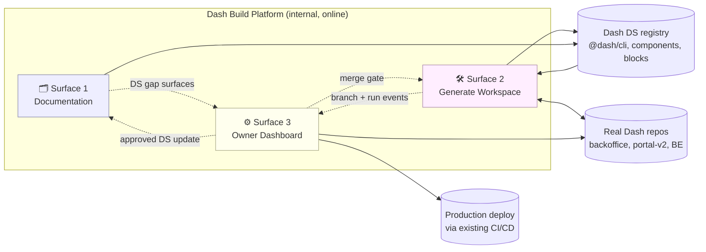
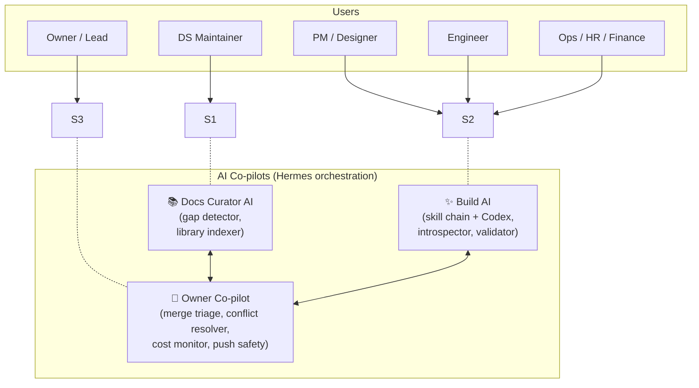
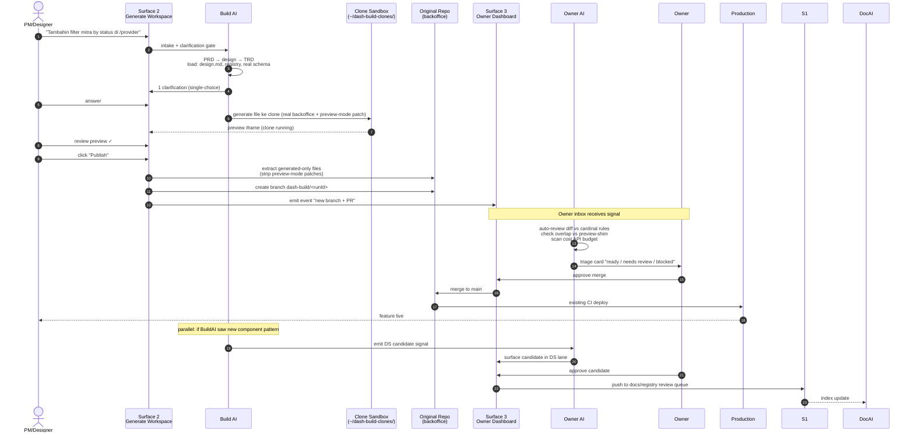
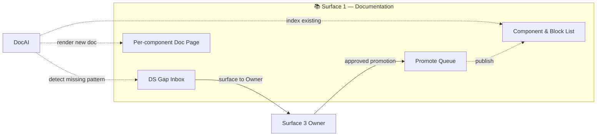
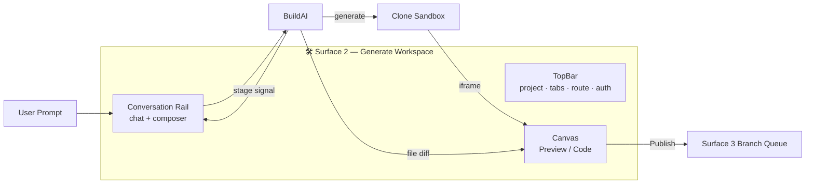
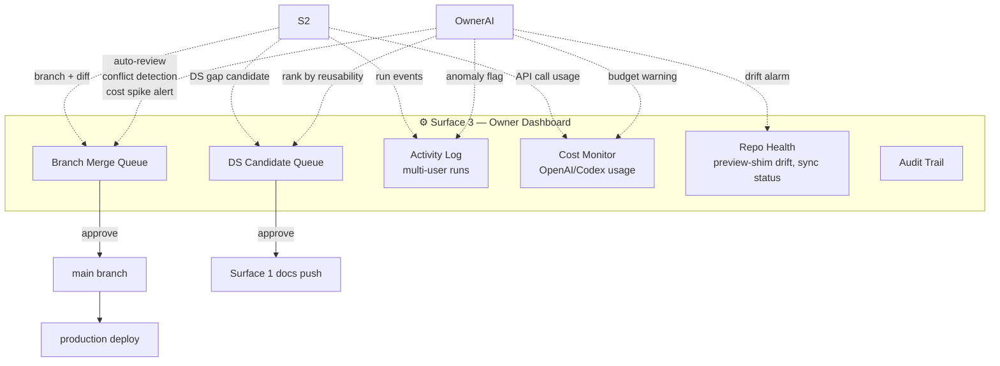
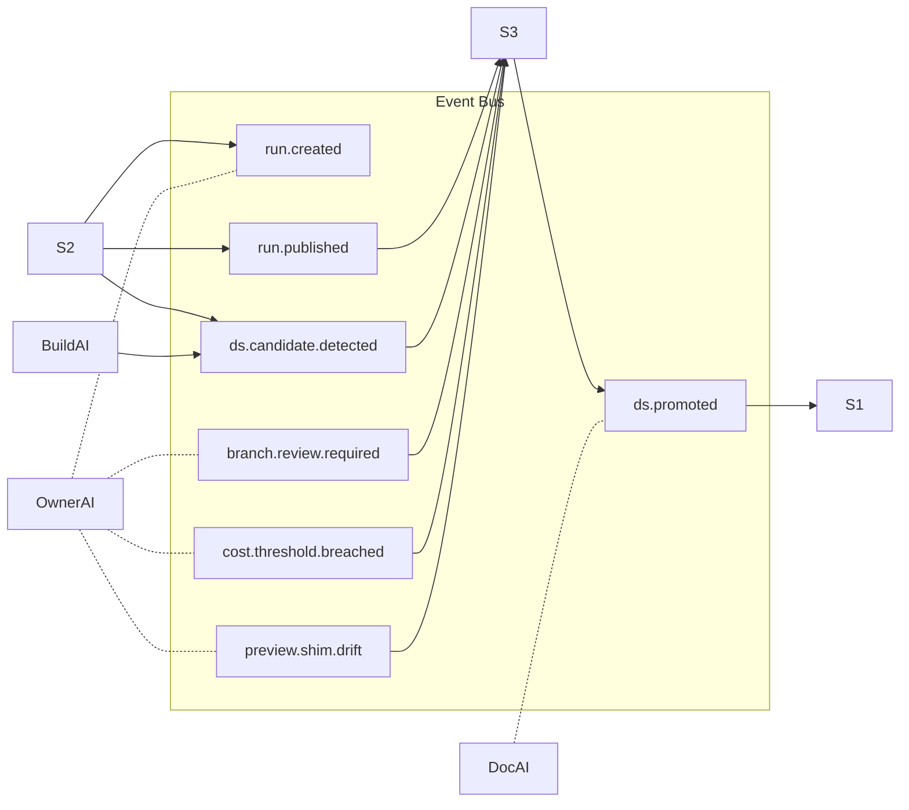
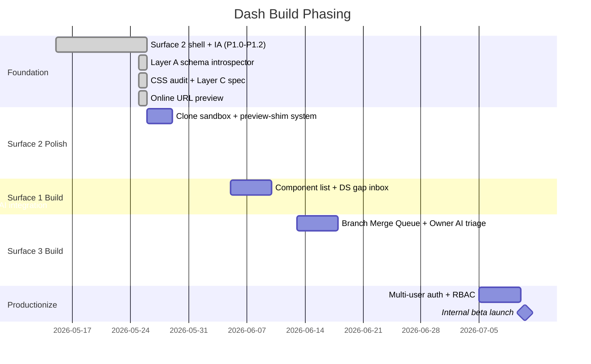

# Dash Build — Master Plan & End-to-End Journey

> Stempel waktu: 2026-05-25. Dokumen ini = single source-of-truth untuk tujuan, arsitektur 3-surface, dan flow end-to-end Dash Build internal platform. Setiap surface SELALU punya AI co-pilot — bukan 1 manusia handle semua.

---

## 1. Tujuan

**Visi**: Setiap Dash team member (PM, designer, ops, eng) bisa improve real Dash product surface lewat prompt natural, output langsung jadi production-ready PR yang aman, sekaligus design system terus berkembang otomatis dari pattern yang sering muncul.

**3 outcome user-visible**:

1. **Speed** — feature/UI change dari ide → preview real → PR dalam < 30 menit.
2. **Safety** — semua perubahan punya audit trail, validate vs design.md, tidak break main, tidak leak preview-mode hack ke production.
3. **Self-improving DS** — gap component yang sering muncul otomatis surface jadi DS candidate, owner review + promote ke registry, library makin lengkap tiap minggu.

**Non-goals**:
- Ganti GitHub sebagai source of truth.
- Generic SaaS builder (Lovable-clone).
- AI tanpa human checkpoint untuk push to main.

---

## 2. 3-Surface Architecture (high-level)

Setiap surface punya target user berbeda + AI co-pilot mandiri.

---

## 3. Persona × Surface × AI Co-pilot

**Kunci**: Owner dashboard BUKAN 1 manusia manage 10 hal. Owner Co-pilot bantu triage, surface ANOMALY, kasih recommendation. Manusia approve/override saja.

---

## 4. End-to-End Journey (typical feature)

**12 steps end-to-end, dari prompt → production + DS update.**

---

## 5. Surface Deep-Dive

### Surface 1 — Documentation

**Fungsi**:
- Browse semua component/block Dash DS dgn preview live
- Lihat usage stats (di repo mana, frekuensi pakai)
- Inbox DS gap (component yang Build AI detect missing tapi dibutuhkan)
- Promote queue (gap yang sudah ada candidate impl, tunggu review DS Maintainer)

**AI role**:
- Auto-index registry tiap commit
- Detect duplicate components across repos → suggest extract to shared
- Generate doc draft dari component code (props, usage example, state coverage)

---

### Surface 2 — Generate Workspace (yang sedang kita kerjakan)

**Yang sudah jadi** (status sekarang):
- ✓ Canvas-first IA (Lovable-aligned)
- ✓ Single topbar dgn project pill + tabs + route
- ✓ Rail conversation (light theme)
- ✓ Tab Preview/Code working
- ✓ Online URL preview (staging fallback)
- ✓ Layer A schema introspector (real models/enums/endpoints injected ke prompt)
- ✓ CSS audit script + spec doc Layer C

**Yang masih perlu** (next slices):
- Clone sandbox setup + preview-shim patch system
- Extract-and-publish flow (strip preview patches)
- Run history + thread switcher
- Repo switcher visible di topbar (BUG sekarang hidden)
- Compose toolbar enrichment (attach, mode)

---

### Surface 3 — Owner Dashboard (AI-assisted)

**Fungsi**:
- **Branch Merge Queue**: list semua branch `dash-build/*` lintas repo, dgn AI auto-review (cardinal rules, overlap conflict, preview-shim leak detection). Owner klik 1 button approve / request change / reject.
- **DS Candidate Queue**: pattern baru yang Build AI detect → AI rank by reusability + impact → owner approve naik ke Surface 1 docs.
- **Activity Log**: who built what, when, status. AI flag anomaly (run gagal terus, prompt vague, output ditolak berulang).
- **Cost Monitor**: OpenAI/Codex token + API call per user/project. AI alert budget spike.
- **Repo Health**: status preview-shim patch (apply OK, drift, conflict). AI auto-sync attempt + flag manual review kalau gagal.
- **Audit Trail**: semua perubahan + decision history.

**AI role (Owner Co-pilot)**:
- Triage incoming branch — kasih "green / yellow / red" recommendation
- Suggest merge order (dependency analysis)
- Auto-resolve simple conflicts (formatting, lockfile)
- Cost anomaly alert
- DS candidate ranking + dedup
- Activity anomaly detection

**Bukan**: 1 manusia stare 10 dashboard manual. AI handle 80% triage, manusia decide critical 20%.

---

## 6. Cross-Surface Signals

Semua surface komunikasi via event bus. Hermes orchestrate AI agent subscribe ke event yang relevan.

---

## 7. Phasing

**Sequence logic**:
1. Surface 2 truthful preview FIRST (without itu, sisanya cuma teori)
2. Surface 1 builds on Surface 2 generation events (DS gap signals)
3. Surface 3 builds on Surface 1 + 2 event streams (merge queue, candidate inbox, activity)
4. Hermes wire = final layer

---

## 8. AI Agents Inventory

| Agent | Surface | Tugas | Status |
|---|---|---|---|
| **Skill Chain** | S2 | intake → PRD → design → TRD → Codex → validate | ✓ exists |
| **Schema Introspector** | S2 | parse Prisma/enums/endpoints/components → inject ke prompt | ✓ landed Layer A |
| **Repo Context Pack** | S2 | resolve repo/theme/route/nav | ✓ exists |
| **Clarification Engine** | S2 | gate vague prompts | ✓ exists |
| **Doc Curator AI** | S1 | index registry, detect gap, generate doc draft | 🔲 P2 |
| **Owner Co-pilot** | S3 | branch triage, conflict resolve, cost alert, anomaly flag | 🔲 P2 |
| **Hermes Orchestrator** | cross | route events to right AI, manage agent lifecycle | 🔲 P3 |
| **CSS Audit** | tooling | grep hex violations | ✓ landed |
| **Preview-shim Sync** | S2 ops | re-apply patch on backoffice main update, flag drift | 🔲 P1 |

---

## 9. Open Decisions (need answer sebelum lanjut)

| # | Decision | Options | Blocker untuk |
|---|---|---|---|
| OD-1 | Preview-mode delivery | (a) Clone-and-patch (Dash Build owns), (b) BE add `NEXT_PUBLIC_PREVIEW_MODE` env (BE collab) | Surface 2 P1 clone slice |
| OD-2 | API data source preview | (a) Staging API public reachable, (b) Mock data per route, (c) Recorded fixtures | Clone preview useful-ness |
| OD-3 | Hermes orchestration timing | (a) Build per-surface AI first, wire Hermes P3, (b) Wire Hermes early P1 | Agent isolation vs integration speed |
| OD-4 | DS candidate auto-promote | (a) Always manual approve, (b) Auto-promote if 3+ repos use similar pattern | DS evolution velocity |
| OD-5 | Multi-user identity | (a) Google SSO via Firebase (same as backoffice), (b) GitHub OAuth, (c) None — local-only forever | RBAC + cost attribution |
| OD-6 | Owner-AI override authority | (a) AI suggest only, owner always approve, (b) AI auto-merge trivial PRs (formatting, deps bump) | Owner workload reduction |
| OD-7 | Diff view priority | P1 or P2? | Code tab evolution |
| OD-8 | Theme toggle (dark mode) | P2 or never? | builder-shell-brief consistency |

---

## 10. Cara visualisasi

Dokumen ini punya 7 mermaid diagram. Cara render:

**Online (paling cepat)**:
- Paste ke https://mermaid.live/ (mermaid live editor) per block
- Lihat render real-time, export PNG/SVG

**Obsidian (local + persistent)**:
- Install Obsidian + plugin Mermaid (built-in di v1.0+)
- Buka file ini di vault → auto render
- Plus: pakai "Excalidraw" plugin untuk sketch ulang kalau perlu tweak

**GitHub (kalau commit)**:
- GitHub native render mermaid di markdown
- PR review = bisa visual

**Local CLI**:
- `npx @mermaid-js/mermaid-cli -i master-plan-2026-05-25.md -o diagrams/`

**Recommendation**: pakai Obsidian untuk iterasi (lo bisa edit + auto render side-by-side). Export PNG diagram penting untuk share ke stakeholder.

---

## 11. Next steps konkret

Per status saat ini:

1. **Konfirmasi OD-1** (preview-mode delivery): clone-and-patch atau BE env? Gua recommend clone-and-patch SOLO bisa start sekarang, plan migrate ke BE env saat collab buka.

2. **Konfirmasi OD-2** (API data): kalau staging API public reachable, lo paste sample endpoint test result → gua proceed dgn baseURL override ke staging. Kalau ga, plan mock data per route.

3. **Konfirmasi OD-5** (multi-user identity): kalau lo OK local-only forever sampai Hermes ready, skip auth integration di Surface 2 sekarang.

4. **Approve plan ini** → gua mulai slice P1.0 clone sandbox + preview-shim system besok pagi.

5. **Bookmark dokumen** ini di repo `packages/dash-build/docs/master-plan-2026-05-25.md`. Setiap slice future = update Phasing section + AI Agents Inventory + Open Decisions.

---

## Appendix — File-level kanonik

| Concern | Path |
|---|---|
| Master plan ini | `packages/dash-build/docs/master-plan-2026-05-25.md` |
| Builder shell spec (Layer C) | `packages/dash-build/docs/builder-shell-brief.md` |
| Product model | `packages/dash-build/docs/product-model.md` |
| gstack adoption | `packages/dash-build/docs/gstack-adoption.md` |
| Open Design reference | `packages/dash-build/docs/open-design-reference.md` |
| Design contract (root) | `design.md` |
| Cardinal rules | `apps/docs/registry/rules/dash-ai-rules.md` |
| 3-surface memory | `~/.claude/projects/-Users-irfanprimaputra-b/memory/project_dash_build_three_surface_architecture.md` |
