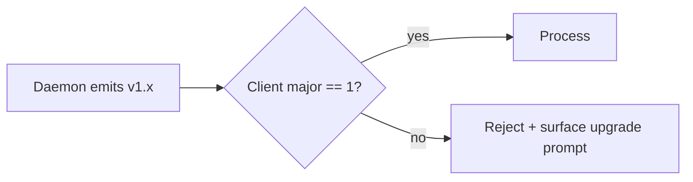

# Agent Observability Protocol (AOP) v1.0.0

**Status:** Draft
**Date:** 2026-05-28
**Owner:** dash-build
**Audience:** dash-build daemon authors, Dash Dashboard implementers, auditors
**Protocol header:** `X-Dash-AOP: 1.0.0`

---

## TL;DR

Dash Build runs an AI agent (OpenAI / Codex) that reads a target repo, queries the Dash DS registry, generates code, validates it, and opens a PR. Today the agent is a black box — humans cannot answer "why did it pick `<Button variant="ghost">` over `<IconButton>`?" without re-running it.

The **Agent Observability Protocol (AOP)** defines a versioned event stream the daemon emits during every run, in three coordinated formats:

1. **Hot** — Server-Sent Events (SSE) on `GET /v1/runs/:runId/stream` for live UI.
2. **Warm** — JSON Lines (`.jsonl`) on disk for deterministic replay and post-mortem.
3. **Cold** — A Markdown digest auto-attached to the PR description as the human-readable audit trail.

All three derive from the **same 9 event types**. Schemas are TypeScript-checked and frozen per major version.

---

## Goals

1. **Auditability.** A human can reconstruct *why* the agent did what it did from the JSONL file alone.
2. **Live UX.** Dash Dashboard can render the run as it happens, with sub-second event latency.
3. **Replay.** Given a JSONL trace, a UI can re-render the run offline, identically.
4. **Cost transparency.** Token spend per run is first-class, not buried in OpenAI dashboards.
5. **Cheap.** No new infra: filesystem + SSE + existing HTTP server on `:7799`.
6. **Stable.** Major version bumps are rare; consumers can pin and trust.

## Non-goals

- Multi-tenant log aggregation (single-user local daemon).
- Real-time collaboration / cursor sharing.
- Replacing OpenTelemetry for system-level tracing — AOP is *agent-semantic*, not RED-metric.
- Persistent storage beyond local `~/.dash-build/runs/` (cloud sync is a future concern).
- Streaming partial token output from the LLM (events are *agent decisions*, not raw tokens).

---

## Event types

All events share an envelope:

```ts
interface AOPEnvelope<T extends AOPEventType, P> {
  v: "1.0.0";              // protocol version
  type: T;                 // discriminator
  runId: string;           // ULID, stable per run
  seq: number;             // monotonic per run, starts at 0
  ts: string;              // ISO-8601 with ms, UTC
  payload: P;
}

type AOPEventType =
  | "run.start"
  | "thinking"
  | "scan"
  | "decision"
  | "artifact"
  | "validate"
  | "cost"
  | "error"
  | "run.end";
```

### Summary table

| Type        | Cardinality | Required | Purpose                                       |
|-------------|-------------|----------|-----------------------------------------------|
| `run.start` | exactly 1   | yes      | Run kickoff; identity + budget                |
| `thinking`  | 0..N        | no       | Free-form agent reasoning (reason/hypothesis/risk) |
| `scan`      | 0..N        | no       | Read of repo, deps, or types                  |
| `decision`  | 0..N        | yes\*    | Branching point with candidates + pick        |
| `artifact`  | 0..N        | no       | File create/edit/delete with diff             |
| `validate`  | 0..N        | yes\*    | Lint/type/test/registry-conformance result    |
| `cost`      | 0..N        | yes\*    | Per-LLM-call token + USD                      |
| `error`     | 0..N        | no       | Recoverable or fatal                          |
| `run.end`   | exactly 1   | yes      | Terminal status + PR URL                      |

\* At least one expected in any non-trivial run.

---

### `run.start`

```ts
interface RunStartPayload {
  prompt: string;                // user instruction, verbatim
  targetRepo: {
    url: string;                 // git remote, e.g. github.com/dash/web
    branch: string;              // base branch the agent forked from
    commit: string;              // sha at scan time
  };
  model: {
    provider: "openai" | "anthropic" | "codex-local";
    name: string;                // "gpt-5", "claude-opus-4-7", etc.
    version?: string;
  };
  budget: {
    maxUsd: number;              // hard ceiling; emits error + run.end on breach
    maxDurationMs: number;
    maxTokens: number;
  };
  initiator: "cli" | "api" | "schedule" | "webhook";
}
```

### `thinking`

```ts
interface ThinkingPayload {
  kind: "reason" | "hypothesis" | "risk";
  md: string;                    // markdown, <= 4 KB; longer truncated with ellipsis marker
  refs?: string[];               // optional event seq references (e.g. "scan@3")
}
```

`reason` = "here is what I'm doing and why"
`hypothesis` = "I believe X; if X is wrong, plan changes"
`risk` = "this could break / this is uncertain"

### `scan`

```ts
interface ScanPayload {
  kind: "file" | "dep" | "type" | "registry";
  paths: string[];               // repo-relative for file/registry; package names for dep
  snippet?: string;              // <= 2 KB excerpt that drove the next decision
  bytesRead: number;
}
```

### `decision`

```ts
interface DecisionPayload {
  step: string;                  // human label, e.g. "pick-button-variant"
  node: string;                  // dotted path in plan tree, e.g. "scaffold.header.cta"
  candidates: Array<{
    name: string;                // e.g. "Button:ghost"
    score: number;               // 0..1
    reason: string;              // one-line justification
  }>;
  picked: string;                // must match a candidate.name
  rationale: string;             // markdown, why this beat the rest
  reversible: boolean;           // can a later decision undo it cleanly?
}
```

### `artifact`

```ts
interface ArtifactPayload {
  path: string;                  // repo-relative
  op: "create" | "edit" | "delete";
  diff: string;                  // unified diff; for create = full file
  loc: { added: number; removed: number };
  language?: string;             // tsx, ts, css, md, ...
  registryRef?: string;          // e.g. "dash/Button@2.1.0" if generated from a DS component
}
```

### `validate`

```ts
interface ValidatePayload {
  checks: Array<{
    name: string;                // "tsc", "eslint", "vitest", "registry-conformance"
    status: "pass" | "fail" | "skip" | "warn";
    durationMs: number;
    output?: string;             // <= 8 KB, stderr/stdout summary
  }>;
  overall: "pass" | "fail" | "warn";
  scope: "file" | "package" | "repo";
  target?: string;               // path scoped to, if scope != repo
}
```

### `cost`

```ts
interface CostPayload {
  provider: "openai" | "anthropic" | "codex-local";
  model: string;
  call: "completion" | "embedding" | "tool" | "vision";
  tokens_in: number;
  tokens_out: number;
  tokens_cached?: number;        // prompt cache hits
  usd: number;                   // computed at emission time using current pricing
  cumulativeUsd: number;         // running total for this run
}
```

### `error`

```ts
interface ErrorPayload {
  code: string;                  // stable machine code, e.g. "REGISTRY_FETCH_FAILED"
  message: string;
  stack?: string;
  recoverable: boolean;
  retryCount?: number;
}
```

### `run.end`

```ts
interface RunEndPayload {
  status: "success" | "aborted" | "failed";
  durationMs: number;
  pr?: {
    url: string;
    number: number;
    title: string;
  };
  summary: {
    artifacts: number;
    decisions: number;
    validations: { pass: number; fail: number };
    totalUsd: number;
    totalTokens: number;
  };
  reason?: string;               // required if status != "success"
}
```

---

## Wire formats

### Hot — SSE

`GET http://localhost:7799/v1/runs/:runId/stream`

```
HTTP/1.1 200 OK
Content-Type: text/event-stream
Cache-Control: no-cache
X-Dash-AOP: 1.0.0

event: aop
id: 0
data: {"v":"1.0.0","type":"run.start","runId":"01J...","seq":0,"ts":"...","payload":{...}}

event: aop
id: 1
data: {"v":"1.0.0","type":"thinking","runId":"01J...","seq":1,"ts":"...","payload":{...}}
```

- One SSE `event: aop` per envelope. No batching.
- `id` mirrors `seq` → clients can resume with `Last-Event-ID`.
- Heartbeat `: keepalive` comment every 15 s.
- Stream closes after `run.end` is flushed.

### Warm — JSONL

`~/.dash-build/runs/<runId>.jsonl`

```jsonl
{"v":"1.0.0","type":"run.start","runId":"01J...","seq":0,"ts":"2026-05-28T03:11:00.000Z","payload":{...}}
{"v":"1.0.0","type":"thinking","runId":"01J...","seq":1,"ts":"2026-05-28T03:11:00.420Z","payload":{...}}
...
{"v":"1.0.0","type":"run.end","runId":"01J...","seq":42,"ts":"2026-05-28T03:13:17.080Z","payload":{...}}
```

- One envelope per line, UTF-8, LF terminator.
- File is append-only while run is live; renamed atomically on `run.end` from `<runId>.jsonl.partial` → `<runId>.jsonl`.
- First line of every JSONL file MUST be `run.start`.

### Cold — Markdown digest

Auto-appended to PR description under `<!-- aop:digest -->` ... `<!-- /aop:digest -->`:

```markdown
## Agent run summary

- **Run** `01J...` · model `gpt-5` · 2m 17s · $0.42 · 12.4k tokens
- **Decisions** 8 (key: `pick-button-variant` → `Button:ghost`)
- **Artifacts** 4 created / 2 edited
- **Validations** 5 pass / 0 fail
- **Replay** `dash-build replay 01J...`

<details><summary>Decision log</summary>

| Step | Pick | Why |
|------|------|-----|
| scaffold.header.cta | Button:ghost | matches "subtle CTA" in prompt; ds-token coverage 100% |
| ... | ... | ... |

</details>
```

---

## Versioning

- **Semver 2.0** on the protocol itself (`v` field + `X-Dash-AOP` header).
- **Major** bump = breaking change to any payload schema or event type set. Old JSONL files MUST stay readable forever (replayer keeps N-1 adapters).
- **Minor** = additive (new event type, new optional field).
- **Patch** = doc/clarification only.
- Clients MUST reject envelopes whose `v` major differs from theirs. They MAY warn on minor mismatch.



---

## Replay format spec

A "replay" is the JSONL file plus the original repo commit SHA. Replay invariants:

1. **Ordering** — events MUST be sorted by `seq` ascending. `ts` is wall-clock and not authoritative for order.
2. **Self-contained** — diffs in `artifact` events MUST be applicable against `targetRepo.commit` from `run.start`. No external lookups required to render the run.
3. **Deterministic rendering** — given the same JSONL, a UI MUST produce the same DOM. No randomness in event interpretation.
4. **Truncation marker** — long fields end with `…[truncated:N bytes]` so consumers detect drops.

Replay CLI:

```
dash-build replay <runId>           # prints timeline to stdout
dash-build replay <runId> --serve   # boots local SSE replay at :7800 for UI dev
```

---

## Storage convention

```
~/.dash-build/
  runs/
    01JABC...jsonl              # completed run
    01JDEF...jsonl.partial      # in-flight (atomic rename on done)
  index.jsonl                   # one line per run, append-only
  config.json                   # retention policy, redaction rules
```

Default retention: keep last **100 runs**, prune oldest. `index.jsonl` keeps a stub (`runId`, `prompt`, `status`, `pr.url`, `totalUsd`) for fast listing without rehydrating bodies.

---

## Sample run trace

Prompt: *"Build a refund request page in the support area, follow Dash DS, link from Settings."*

```jsonl
{"v":"1.0.0","type":"run.start","runId":"01JBX","seq":0,"ts":"2026-05-28T03:11:00.000Z","payload":{"prompt":"Build a refund request page...","targetRepo":{"url":"github.com/dash/web","branch":"main","commit":"a1b2c3d"},"model":{"provider":"openai","name":"gpt-5"},"budget":{"maxUsd":2,"maxDurationMs":300000,"maxTokens":80000},"initiator":"cli"}}
{"v":"1.0.0","type":"thinking","runId":"01JBX","seq":1,"ts":"2026-05-28T03:11:00.420Z","payload":{"kind":"reason","md":"Need to find the existing support area to slot a new page next to it."}}
{"v":"1.0.0","type":"scan","runId":"01JBX","seq":2,"ts":"2026-05-28T03:11:01.110Z","payload":{"kind":"file","paths":["apps/web/src/pages/support/index.tsx","apps/web/src/pages/settings/index.tsx"],"snippet":"export default function SupportHome() {...}","bytesRead":2811}}
{"v":"1.0.0","type":"scan","runId":"01JBX","seq":3,"ts":"2026-05-28T03:11:01.900Z","payload":{"kind":"registry","paths":["dash/Button","dash/FormField","dash/PageHeader"],"bytesRead":4422}}
{"v":"1.0.0","type":"decision","runId":"01JBX","seq":4,"ts":"2026-05-28T03:11:03.140Z","payload":{"step":"pick-layout","node":"page.refund","candidates":[{"name":"PageHeader+Form","score":0.92,"reason":"matches 4 sibling pages"},{"name":"Modal","score":0.31,"reason":"prompt says 'page', not 'modal'"}],"picked":"PageHeader+Form","rationale":"Sibling pages use PageHeader+Form; prompt explicitly says page.","reversible":true}}
{"v":"1.0.0","type":"cost","runId":"01JBX","seq":5,"ts":"2026-05-28T03:11:03.150Z","payload":{"provider":"openai","model":"gpt-5","call":"completion","tokens_in":2104,"tokens_out":312,"usd":0.018,"cumulativeUsd":0.018}}
{"v":"1.0.0","type":"artifact","runId":"01JBX","seq":6,"ts":"2026-05-28T03:11:05.770Z","payload":{"path":"apps/web/src/pages/support/refund.tsx","op":"create","diff":"+ import { PageHeader, FormField, Button } from '@dash/ui'...","loc":{"added":74,"removed":0},"language":"tsx","registryRef":"dash/PageHeader@1.4.0"}}
{"v":"1.0.0","type":"artifact","runId":"01JBX","seq":7,"ts":"2026-05-28T03:11:06.220Z","payload":{"path":"apps/web/src/pages/settings/index.tsx","op":"edit","diff":"@@ ...\n+ <Link href='/support/refund'>Request refund</Link>","loc":{"added":1,"removed":0},"language":"tsx"}}
{"v":"1.0.0","type":"validate","runId":"01JBX","seq":8,"ts":"2026-05-28T03:11:11.500Z","payload":{"checks":[{"name":"tsc","status":"pass","durationMs":3120},{"name":"eslint","status":"pass","durationMs":840},{"name":"registry-conformance","status":"pass","durationMs":210}],"overall":"pass","scope":"package","target":"apps/web"}}
{"v":"1.0.0","type":"run.end","runId":"01JBX","seq":9,"ts":"2026-05-28T03:11:17.010Z","payload":{"status":"success","durationMs":17010,"pr":{"url":"https://github.com/dash/web/pull/812","number":812,"title":"feat(support): refund request page"},"summary":{"artifacts":2,"decisions":1,"validations":{"pass":1,"fail":0},"totalUsd":0.018,"totalTokens":2416}}}
```

---

## Validator behavior

A JSONL file is **valid** iff:

1. First line is `run.start`, last line is `run.end`.
2. `seq` is strictly monotonic from 0, no gaps.
3. All envelopes share the same `runId`.
4. All envelopes share the same `v` major.
5. Every `decision.picked` matches a `candidates[].name` in the same event.
6. Every `artifact.path` is a POSIX relative path (no `..`, no leading `/`).
7. `run.end.summary.totalUsd` equals the last `cost.cumulativeUsd` (±0.001) when any cost events exist.
8. Total bytes < 50 MB (else file is split and chained via `meta.continuesFrom` — out of scope for v1).

CLI: `dash-build validate <file.jsonl>` returns exit 0/1 and a JSON report.

---

## Privacy

The daemon runs locally but PRs are public-ish. Before emission, every payload passes through a **redactor**:

| Pattern                                      | Action                          |
|----------------------------------------------|---------------------------------|
| `sk-[A-Za-z0-9]{20,}` (OpenAI key)           | replace with `sk-***REDACTED`   |
| `ghp_[A-Za-z0-9]{20,}` (GitHub token)        | replace with `ghp_***REDACTED`  |
| `Bearer\s+[A-Za-z0-9._-]+`                   | replace with `Bearer ***REDACTED` |
| email-shaped string in `prompt`              | replace local-part with `***`   |
| `.env*` file contents in `scan.snippet`      | drop snippet, keep path         |

Redaction is applied to **all three formats** (SSE, JSONL, MD). The MD digest additionally strips any field over 1 KB. Users may extend rules via `~/.dash-build/config.json#redaction`.

---

## Open questions

1. **Tool-call granularity** — should each LLM tool call get its own event type, or are they implicit in `scan` / `artifact`? Leaning *implicit* for v1 to keep the surface small.
2. **Streaming partial diffs** — when an artifact is large, do we emit one `artifact` event with full diff, or chunked deltas? v1 says one event; revisit if we ever exceed 1 MB diffs.
3. **Cross-run correlation** — when a PR triggers a follow-up run (e.g. fix review comments), should events carry a `parentRunId`? Probably yes in 1.1.
4. **Schema distribution** — ship `.d.ts` + JSON Schema in a separate `@dash/aop-schema` package, or inline in `dash-build`? Affects Dash Dashboard's dependency graph.
5. **Clock skew** — `ts` is daemon-local. For multi-host futures we'd need a Lamport clock layer. Out of scope for single-user v1.
6. **Compression** — JSONL files gzip well (~8x). Auto-compress on rotation, or leave raw? Leaving raw for now so `tail -f` works.

---

*End of AOP v1.0.0 spec.*
