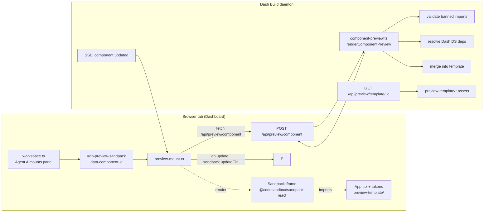

# Component Preview Architecture — Sandpack pick

> Spec for Dash Build daemon component-focused preview (MVP).
> Created 2026-05-28. Supersedes iframe-full-app preview for generated components.

## TL;DR

Dash Build currently boots a full sandboxed dev server for every generated
prompt (esbuild + iframe shell + temp dir bundle). For component-level outputs
this is overkill: cold-start latency, no live token reload, and the iframe
shows whatever the bundler can wedge into a single HTML file rather than a
real React tree with Dash DS context. We replace that path with a
**browser-resident React playground powered by Sandpack** (`@codesandbox/sandpack-react`).
Sandpack compiles + bundles entirely in the browser, mounts the generated
component inside a curated template (Dash DS tokens + mock fixtures
pre-loaded), and exposes hot updates via WebSocket / SSE — no per-prompt
node process, no dev-server spin-up. The full-app iframe pipeline stays as a
fallback for prompts that produce a whole repo, and is deprecated for
component-only outputs.

## Decision matrix

| Option | Cold start | DX | Bundle delta | Token sync | Risk |
|---|---|---|---|---|---|
| **Sandpack** (`@codesandbox/sandpack-react`) | ~600 ms first paint (CDN warm) | React-native, official theme API, ESM | ~85 KB (gz, lazy chunk) | Inject Dash tokens via template `package.json` + CSS file | npm dep + CSP iframe trust |
| Storybook (`storybook/react-vite`) | 8-15 s per server | Mature plugin ecosystem | 5-12 MB | Full preset stack | Server-per-prompt, overkill, breaks "no extra process" goal |
| Custom Vite playground | 2-4 s | Full control | ~40 KB shell + Vite | Hand-build addon API | Re-implements 80% of Sandpack — multi-week build |

## Pick rationale

Sandpack ships the only browser-native React bundler we can drop into a
plain HTML page without a build step on our side. The Dash DS surface today
is React + Tailwind + Dash tokens; Sandpack's `react-ts` template already
matches that runtime. Specifically we get:

- **Zero new daemon processes.** Sandpack runs inside the existing dashboard
  HTML page — the preview panel just mounts an `<iframe>` Sandpack itself
  injects. The daemon only serves a JSON config blob.
- **Real React tree.** The generated `Component.tsx` is imported into a
  template `App.tsx` that wires Dash DS providers + mock data. No more
  "the bundler tried to inline everything into one file" failure mode.
- **Hot edits.** When the source updates over SSE, we call
  `sandpack.updateFile()` — sub-100 ms apply, no full iframe reload.
- **Token contract.** A single `dash-tokens.css` file in the template
  imports the Layer 0 token block (registry CSS variables) so generated
  components render with real Dash Purple, real radii, real spacing.
- **Storybook killed by infra cost.** Booting a Storybook server per prompt
  defeats the entire MVP goal. Custom Vite is a multi-week build.

Trade-off: Sandpack adds `@codesandbox/sandpack-react` to the daemon UI
bundle. We load it lazily (only on workspace pages with a preview panel) and
cap the chunk via dynamic `import()` so the dashboard initial load is
unaffected.

## Architecture diagram



## API contract

### `POST /api/preview/component`

Request body:

```json
{
  "componentSource": "export default function MitraCard() { ... }",
  "dependencies": ["@dash/ui"],
  "mockData": { "mitra": [{ "id": "m1", "name": "..." }] },
  "promptId": "pr_abc123"
}
```

Response (200):

```json
{
  "ok": true,
  "previewId": "preview_xyz",
  "sandpack": {
    "files": {
      "/App.tsx": { "code": "..." },
      "/Component.tsx": { "code": "..." },
      "/index.tsx": { "code": "..." },
      "/dash-tokens.css": { "code": "..." },
      "/mocks.json": { "code": "..." }
    },
    "dependencies": {
      "react": "^18.3.0",
      "react-dom": "^18.3.0"
    },
    "template": "react-ts",
    "entry": "/index.tsx"
  },
  "warnings": []
}
```

Response (400) — banned import:

```json
{
  "ok": false,
  "error": "banned_import",
  "details": [
    { "import": "react-hook-form", "severity": "high", "line": 3 }
  ]
}
```

### `GET /api/preview/template/:id`

Serves static template assets (App.tsx scaffold, token css, mock fixtures)
that Sandpack fetches when bootstrapping the in-browser bundler. Mostly
unused once `POST /api/preview/component` returns the merged `files` map —
this endpoint is for debugging + future client-only flows.

## File structure

```
packages/dash-build/
├── preview-template/                  # NEW — Sandpack template scaffold
│   ├── App.tsx                        # imports ./Component, wires providers + mocks
│   ├── Component.tsx.placeholder      # default placeholder until generation lands
│   ├── index.tsx                      # ReactDOM.createRoot mount
│   ├── dash-tokens.css                # Layer 0 token block (registry vars)
│   ├── mocks.json                     # 4-mitra fixture + sample order data
│   ├── package.json                   # template deps (react 18, react-dom 18)
│   ├── tsconfig.json                  # strict TS for the in-browser bundler
│   └── README.md                      # how the template is consumed
├── src/
│   ├── services/
│   │   ├── component-preview.ts                # NEW — renderComponentPreview()
│   │   └── __tests__/
│   │       └── component-preview.test.ts       # NEW — 10+ test cases
│   └── daemon/
│       ├── routes/api/preview.ts               # NEW — wired into router.ts
│       └── templates/components/preview-panel.ts  # NEW — workspace mount markup
└── docs/specs/component-preview-architecture-2026-05-28.md  # this file
```

## Mount integration with workspace.ts (Agent A)

Agent A's workspace template renders the panel via:

```ts
import { renderPreviewPanel } from "../components/preview-panel.js"

renderPreviewPanel({ componentId: thread.activeRunId, promptId: thread.id })
```

The panel emits a single mount element:

```html
<div
  id="db-preview-sandpack"
  data-component-id="<componentId>"
  data-prompt-id="<promptId>"
  data-preview-state="idle"
></div>
```

Client-side `preview-mount.ts` listens for `[data-component-id]` on DOM ready,
fetches `/api/preview/component`, then calls `Sandpack(...)` to mount.

**Contract for Agent A:** the workspace.ts template MUST render the panel
inside the canvas region, give it sufficient height (>= 480 px), and wire
the SSE `component:updated` event to dispatch a `dash-build:preview-refresh`
CustomEvent on the mount element. The mount script handles the rest.

## Dependencies

| Package | Why | Bundle impact |
|---|---|---|
| `@codesandbox/sandpack-react` | In-browser React bundler + UI | ~85 KB gz (lazy chunk) |
| (peer) `react`, `react-dom` | Sandpack peer deps; already in template | 0 (template-only) |

No server-side npm deps added — `component-preview.ts` is plain TS/Node.

## Browser compat

Sandpack requires ES2020 + service worker support: Chrome 90+, Firefox 90+,
Safari 14+, Edge 90+. Matches existing Dash Build dashboard support matrix.

## Migration plan (deprecation of iframe full-app)

| Phase | Date | Action |
|---|---|---|
| MVP (this PR) | 2026-05-28 | Sandpack preview wired into workspace panel. Iframe full-app remains default for non-component prompts. |
| Phase 2 | T+2 weeks | Pipeline marker — when output is single-component, prefer Sandpack. Keep iframe for multi-file/full-app outputs. |
| Phase 3 | T+4 weeks | Iframe full-app pipeline marked `@deprecated`. esbuild bundler kept for backwards-compatible legacy prompts only. |
| Phase 4 | T+8 weeks | Remove iframe full-app code paths (`src/preview/bundler.ts`, `shell-renderer.ts`) once telemetry confirms Sandpack handles >95% of component prompts. |

## Test strategy

`component-preview.test.ts` covers:

1. `renderComponentPreview` returns Sandpack config with template files merged.
2. Component source is placed at `/Component.tsx`.
3. Banned imports (`react-hook-form`, `zod`, `@tanstack/react-query`, `swr`, `@hookform/resolvers`) are rejected with `banned_import` error.
4. Dash DS import (`@dash/ui`) auto-resolves to local registry alias.
5. Mock data is serialized into `/mocks.json`.
6. Missing component source → 400 `component_source_required`.
7. `dash-tokens.css` is always included.
8. Template `index.tsx` entry never overwritten by user input.
9. Multiple `dependencies` merge without duplicates.
10. `previewId` is stable + deterministic per `(promptId, source-hash)`.
11. Empty `mockData` → empty `/mocks.json` (`{}`), not omitted.
12. Source > 256 KB → 413 `payload_too_large` (defensive).

Route test (`routes.test.ts` augmentation, owned elsewhere): wiring + 404/405
behavior.

Bundle size check (`scripts/check-bundle-size.ts`): Sandpack lazy chunk
asserted `< 100 KB` gz.
