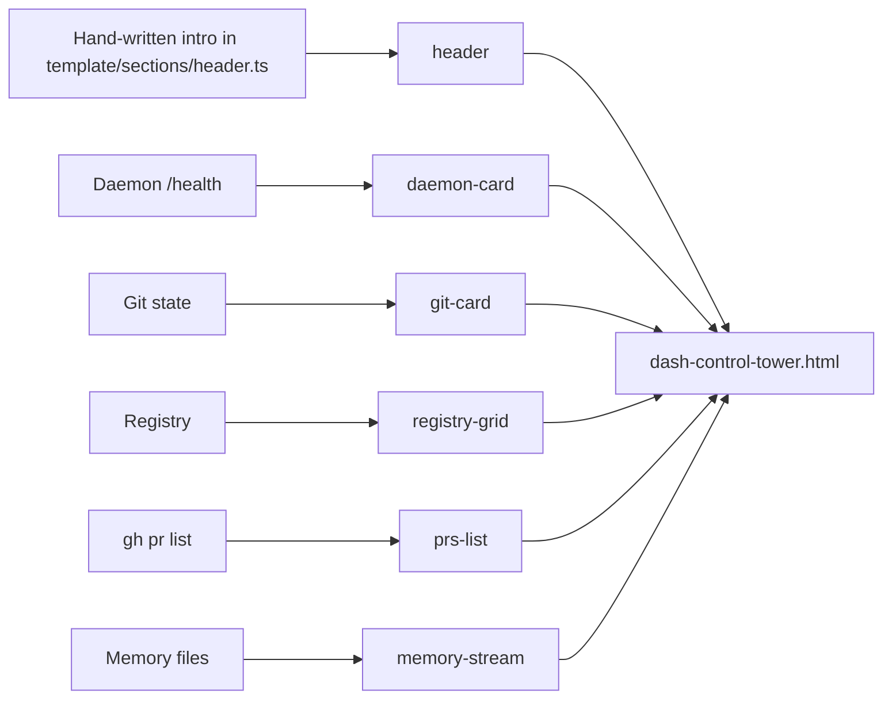

# Control Tower HTML Auto-gen Spec

**Status:** Draft
**Date:** 2026-05-28
**Owner:** dash-build
**Target file:** `packages/dash-build/docs/dash-control-tower.html`

---

## TL;DR

`dash-control-tower.html` is the single-page situational dashboard for the dash-build daemon — what shipped recently, what's in the registry, is the daemon up, what's planned next. It is currently hand-written and drifts within days. This spec defines a Node/TS script (`scripts/gen-control-tower.ts`) that regenerates the HTML from four live sources on demand, with deterministic output suitable for diffing in PRs.

Pick: **template literals** (no EJS). Single-file output, zero runtime deps, easy snapshot tests.

---

## Why — the drift problem

Today the HTML hand-codes:

- "Last commit: a1b2c3d on 2026-05-25" → wrong within hours.
- "Registry has 41 components" → wrong every time we ship one.
- "Daemon running on :7799" → wrong when daemon is off.
- "Active project notes" → diverges from `~/.claude/projects/.../memory/project_dash_build_*.md`.

We've already shipped two PRs whose only diff was bumping these strings. Drift is also a *trust* problem: a stale control tower is worse than no control tower because viewers don't know which numbers to believe.

The fix: regenerate on demand from authoritative sources, fail loudly when a source is unreachable, and keep generation idempotent so diffs are minimal.

---

## Input sources

| # | Source                                              | Parser approach                                               | Failure mode             |
|---|-----------------------------------------------------|---------------------------------------------------------------|--------------------------|
| 1 | Memory files `~/.claude/.../project_dash_build_*.md`| `fs.readdir` + per-file frontmatter via `gray-matter`; body trimmed to first 240 chars for blurb | Skip file, warn          |
| 2 | Git state (repo root)                               | `simple-git`: current branch, last commit (sha+subject+date+author), `git log --since=14d --oneline` | Fatal — git must work    |
| 3 | Registry inventory `apps/docs/registry/dash/`       | `fast-glob` for `*.json`, parse, group by category, count, last-modified per file | Empty section, warn      |
| 4 | Daemon health `GET http://localhost:7799/health`    | `fetch` with 800 ms `AbortController` timeout; expects `{version, uptimeSec, activeRuns, lastRunId}` | Render "offline" badge, no throw |

Additionally (read-only, no parsing):

- Recent PRs via `gh pr list --json number,title,state,url,createdAt --limit 10`. Falls back to "gh not installed" notice.

---

## Output

**One standalone HTML file** written to `packages/dash-build/docs/dash-control-tower.html`.

Constraints:

- No external CSS/JS. All styles inline in `<style>`. Tailwind-like utility classes acceptable as long as defined locally — but prefer hand-written CSS keyed to BEM-ish class names. Total CSS budget: 8 KB.
- Single `<script>` block, optional, for the daemon-health auto-refresh polling. <2 KB.
- File MUST validate as HTML5 (run through `html-validate` in tests).
- File MUST be byte-identical across runs when inputs are unchanged (deterministic ordering, no `Date.now()` in output other than the documented "generated at" stamp).

Header section format:

```
Generated 2026-05-28T03:11:00Z by gen-control-tower v1 · sources: memory, git, registry, daemon(online)
```

---

## Template approach: template literals (rationale)

Considered: EJS, Handlebars, `lit-html` (server side), template literals.

**Pick: tagged template literals + small `html`/`safe` helpers.**

Why:

1. **Zero deps.** Spec ships in `dash-build`; we already avoid bloating its install.
2. **Single-file readability.** Template lives next to the data-shaping code; reviewers don't context-switch.
3. **Snapshot-test friendly.** Output is a plain string; we just compare against a fixture.
4. **No new DSL** for contributors to learn.
5. **Type-safe** — template-literal helpers infer prop types from data-shape functions; EJS does not.

The one EJS advantage (designer-editable templates) doesn't apply: only engineers touch this file, and the design is intentionally austere.

Minimal helpers:

```ts
// scripts/lib/html.ts
const esc = (s: unknown): string =>
  String(s).replace(/[&<>"']/g, c =>
    ({ "&": "&amp;", "<": "&lt;", ">": "&gt;", '"': "&quot;", "'": "&#39;" }[c]!));

export const html = (strings: TemplateStringsArray, ...values: unknown[]) =>
  strings.reduce((acc, s, i) => acc + s + (i < values.length ? esc(values[i]) : ""), "");

export const safe = (s: string) => ({ __safe: s });   // opt-out of escaping
```

---

## File structure

```
packages/dash-build/
  scripts/
    gen-control-tower.ts          # main entry
    lib/
      html.ts                     # tagged-template helpers + safe()
      sources/
        memory.ts                 # readMemoryNotes()
        git.ts                    # readGitState()
        registry.ts               # readRegistryInventory()
        daemon.ts                 # pingDaemon()
        prs.ts                    # readRecentPrs() (gh wrapper)
      template/
        layout.ts                 # top-level <html> shell
        sections/
          header.ts
          daemon-card.ts
          git-card.ts
          registry-grid.ts
          memory-stream.ts
          prs-list.ts
          footer.ts
  docs/
    dash-control-tower.html       # generated output (committed)
    specs/
      control-tower-autogen-2026-05-28.md
  __tests__/
    gen-control-tower.test.ts     # snapshot + drift tests
    fixtures/
      memory/                     # synthetic .md files
      registry/                   # synthetic registry jsons
      expected-output.html
```

---

## CLI contract

```
pnpm gen:control-tower [flags]
```

| Flag                | Default                                  | Behaviour                                          |
|---------------------|------------------------------------------|----------------------------------------------------|
| `--out <path>`      | `packages/dash-build/docs/dash-control-tower.html` | Write target                                       |
| `--check`           | off                                      | Generate to memory, exit 1 if differs from on-disk (CI guardrail) |
| `--watch`           | off                                      | Re-gen on input change (chokidar)                  |
| `--no-daemon`       | off                                      | Skip daemon ping (offline laptop)                  |
| `--no-gh`           | off                                      | Skip `gh` PR fetch                                 |
| `--verbose`         | off                                      | Log each source's parse stats to stderr            |
| `--fixture <dir>`   | unset                                    | Use fixture dir instead of live sources (tests)    |

Exit codes: `0` success, `1` drift detected (`--check`), `2` fatal source error.

`package.json` script:

```json
{
  "scripts": {
    "gen:control-tower": "tsx scripts/gen-control-tower.ts",
    "check:control-tower": "tsx scripts/gen-control-tower.ts --check"
  }
}
```

---

## Refresh cadence

| Phase   | Trigger                                | Notes                                  |
|---------|----------------------------------------|----------------------------------------|
| **Now** | Manual `pnpm gen:control-tower`        | Engineer runs before reviewing daemon  |
| **Q3**  | `--watch` mode while daemon is running | Local dev convenience                  |
| **Q4**  | CI: `pnpm check:control-tower` on every PR + nightly auto-regen PR | Guardrail + freshness                  |
| **Later** | Daemon emits a webhook → script re-runs | When dash-build matures into multi-user |

---

## Sections: auto-regen vs manual



| Section          | Source        | Auto?    | Notes                                          |
|------------------|---------------|----------|------------------------------------------------|
| header tagline   | hand-written  | manual   | Lives in `template/sections/header.ts` constants |
| daemon card      | daemon `/health` | auto  | Shows offline state explicitly                 |
| git card         | git           | auto     | Last commit + 14d activity sparkline (text)    |
| registry grid    | registry      | auto     | Grouped, alphabetised within group             |
| memory stream    | memory        | auto     | Sorted by file mtime desc, top 10              |
| recent PRs       | `gh`          | auto     | Open + recently merged                         |
| footer/legal     | hand-written  | manual   |                                                |

Hand-written sections are *constants in TS files*, not separate templates — keeps everything reviewable in one PR.

---

## Drift detection

Two layers:

1. **CI drift** — `--check` fails the PR if the committed HTML doesn't match a fresh regen. This is the same approach as `prettier --check`.
2. **Content staleness** — at gen time, the script computes per-section "freshness" and emits a small badge:
   - Memory note older than 30 days → `aged` badge.
   - No commit in 14 days → `quiet repo` badge.
   - Daemon last-seen >24 h → `daemon stale` badge.
   - Registry component unchanged >90 days → no badge, but listed in `--verbose` report.

Thresholds live in `scripts/lib/freshness.ts` as named constants:

```ts
export const STALE = {
  memoryNoteDays: 30,
  repoQuietDays: 14,
  daemonStaleHours: 24,
  registryColdDays: 90,
} as const;
```

---

## Testing strategy

1. **Snapshot test** (Vitest):
   - Feed `--fixture __tests__/fixtures/` so all sources are deterministic.
   - Assert generated HTML byte-equals `expected-output.html`.
   - Update via `pnpm test -u` with explicit reviewer call-out in PR template.

2. **HTML validity** — pipe output through `html-validate` programmatic API; assert 0 errors.

3. **Per-source unit tests** — each `sources/*.ts` parser has its own test against fixtures (covers empty repo, missing daemon, malformed memory file, etc.).

4. **Drift integration test** — run twice in a row against the same fixture, assert byte-identical output (catches accidental `Date.now()` leaks).

5. **Smoke test** in CI on Linux + macOS, with and without `gh` installed.

---

## Pseudocode — main entry

```ts
// scripts/gen-control-tower.ts
import { writeFile, readFile } from "node:fs/promises";
import { resolve } from "node:path";
import { parseArgs } from "node:util";
import { readMemoryNotes } from "./lib/sources/memory";
import { readGitState } from "./lib/sources/git";
import { readRegistryInventory } from "./lib/sources/registry";
import { pingDaemon } from "./lib/sources/daemon";
import { readRecentPrs } from "./lib/sources/prs";
import { renderLayout } from "./lib/template/layout";

async function main() {
  const { values } = parseArgs({
    options: {
      out: { type: "string", default: "docs/dash-control-tower.html" },
      check: { type: "boolean", default: false },
      watch: { type: "boolean", default: false },
      "no-daemon": { type: "boolean", default: false },
      "no-gh": { type: "boolean", default: false },
      fixture: { type: "string" },
      verbose: { type: "boolean", default: false },
    },
  });

  const root = values.fixture ? resolve(values.fixture) : process.cwd();

  // Sources resolved in parallel; fatal ones throw, soft ones return shaped fallbacks.
  const [memory, git, registry, daemon, prs] = await Promise.all([
    readMemoryNotes(root, { verbose: values.verbose }),
    readGitState(root),                                              // fatal on failure
    readRegistryInventory(root, { verbose: values.verbose }),
    values["no-daemon"] ? Promise.resolve({ status: "skipped" } as const)
                        : pingDaemon("http://localhost:7799", 800),
    values["no-gh"]     ? Promise.resolve({ status: "skipped" } as const)
                        : readRecentPrs(root),
  ]);

  const html = renderLayout({
    generatedAt: new Date().toISOString(),
    sources: { memory, git, registry, daemon, prs },
  });

  const outPath = resolve(root, values.out);

  if (values.check) {
    const current = await readFile(outPath, "utf8").catch(() => "");
    if (current !== html) {
      process.stderr.write("control-tower drift — run `pnpm gen:control-tower`\n");
      process.exit(1);
    }
    return;
  }

  await writeFile(outPath, html, "utf8");
  if (values.verbose) process.stderr.write(`wrote ${outPath} (${html.length} bytes)\n`);
}

main().catch(err => {
  process.stderr.write(`fatal: ${err.message}\n`);
  process.exit(2);
});
```

---

## Open questions

1. **Should daemon polling be server-side (script re-runs on a timer) or client-side (small JS in the HTML hitting `/health`)?** Client-side is cheaper but adds a network dep to a "static" doc. Leaning *server-side regen + manual refresh* for v1; revisit if it becomes annoying.
2. **Memory file location is user-specific (`/Users/irfanprimaputra.b/...`)** — generated HTML must not leak this absolute path. Source paths are stripped to basenames before render. Confirm with team this is acceptable for a single-user tool.
3. **Do we commit the generated HTML or `.gitignore` it?** Recommendation: **commit** so GitHub previews work and PR reviewers see the diff. `--check` then doubles as a "did you forget to regen" guard.
4. **Section ordering** — current layout puts daemon first because it's the most volatile. Worth user-testing once Dash Dashboard exists; the HTML view may become an archival mirror, not the primary surface.
5. **`gh` auth scope** — `gh pr list` needs `repo` scope. If the developer hasn't auth'd, we degrade gracefully — but should we *fail* in CI to force the auth? Leaning yes for CI, no for local dev.
6. **Coupling with AOP** — eventually the daemon card should show last N runs from `~/.dash-build/runs/`. That belongs to AOP v1 (sibling spec). Out of scope here but the daemon-card section is designed to grow that subsection without re-layout.

---

*End of control-tower autogen spec.*
