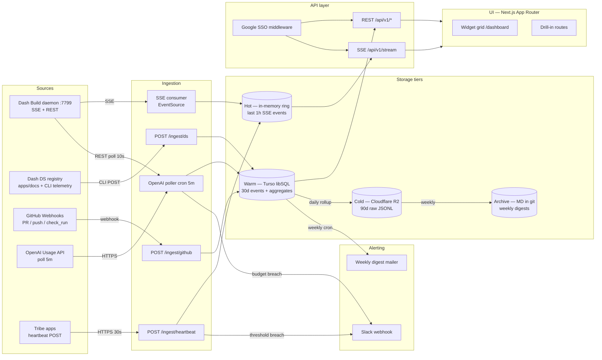

# TRD — Dash Dashboard (Control Tower)
Date: 2026-05-28
Status: Draft v1.1 (Wave 2 decisions applied)
Owner: Irfan (tech lead, acting)
Companion: [`dash-dashboard-prd-2026-05-28.md`](./dash-dashboard-prd-2026-05-28.md)

> Generated by Plan subagent (overnight autonomous run). Wave 2 decisions applied 2026-05-28.

## DECISIONS APPLIED 2026-05-28 (Wave 2)

| Q | Decision | Replaces TRD section |
|---|---|---|
| Q5 | **Monorepo** — `packages/dashboard/` in `dash-ds` repo | TQ3 |
| Q6 | **Real Google SSO** via `next-auth` v5 from day 1 | §5, TQ5 |
| Q7 | **Railway** (not Vercel) — see migration note below | §2 Stack, §9 Deployment, §10 Observability, §11 F11, TQ2 |
| Q8 | **Opt-out** DS telemetry — CLI flag `--no-telemetry` | §3 Data Ingestion |
| Q4 | **Extract** `@dash/aop-schema` as separate package | Referenced from PRD §3 |
| Q2 | MVP widget #3 = **Tribe app health board** (not AI audit log) | PRD §6 |

### Vercel → Railway migration notes
- **Hosting**: Railway instead of Vercel. `railway.json` config + nixpacks. Same Next.js app, no code change.
- **Background jobs (§2, §9)**: Railway Cron OR `node-cron` worker process. NOT Vercel Cron.
- **Secrets (§9.3)**: Railway env vars dashboard. `railway variables set KEY=value`. Equivalent to Vercel envs.
- **Preview deploys (§9.2)**: Railway PR environments (one Railway service per PR branch). URLs: `<service>-pr-N.up.railway.app`.
- **Observability (§10)**: Pino → Axiom unchanged. Drop "Vercel Analytics" — use Railway metrics + Axiom.
- **F11 free-tier**: Railway $5/mo Starter plan covers MVP (~$0 effective with $5 free credit). Upgrade to Hobby $10/mo or Pro at scale.
- **CI (§9.1)**: `railway up --service dashboard` instead of Vercel deploy step. GitHub Actions still orchestrates.
- All §2/§9/§10/§11 lines mentioning "Vercel" verbatim should be read as Railway equivalent.

---

## 1. Architecture



---

## 2. Stack

| Layer | Choice | Rationale |
|---|---|---|
| **Frontend framework** | Next.js 15 App Router + TypeScript | Already standard in `apps/docs/`; built-in SSE/RSC; matches portal-v2 conventions for engineer familiarity |
| **UI components** | `dash add` from Dash DS Layer 1 + custom Layer 3 blocks under `registry/dash/blocks/dashboard/` | Mandated by `design.md`; dogfoods our own DS — Dashboard is the showcase customer |
| **State management** | `useState` + `useReducer` + URL state (`useSearchParams`). **No** TanStack Query, **no** SWR (banned per `CLAUDE.md`) | Polling + SSE handled by small custom hooks (`useSSE`, `usePoll`); state cache in memory + sessionStorage |
| **Charts** | `visx` (from `@visx/*`) — primitive layer | No `recharts` (banned); `visx` gives unstyled SVG primitives we can theme via Dash tokens |
| **Backend runtime** | Node.js 22 (LTS) within same Next.js app via Route Handlers | Single deployable; no separate API server until Phase 4 spin-out |
| **Hot store** | In-memory ring buffer (~5MB cap per stream) | SSE replay needs sub-ms reads; ephemeral by design |
| **Warm store** | **Turso (libSQL)** — SQLite at the edge | Cheap (~$0 at our scale), low-latency reads, file-based mental model fits "events + aggregates", easy backup; Postgres overkill for <1M events/mo |
| **Cold store** | **Cloudflare R2** (S3-compatible) — JSONL files partitioned by day/source | $0.015/GB/mo, no egress; 90-day raw event archive for replay |
| **Archive** | Weekly digest as markdown in `dash-dashboard/archive/YYYY-WW.md`, committed via GitHub App | Auditable, greppable, free; recovers history if all stores die |
| **Auth** | Google SSO via Dash workspace (`@dash.com` and `@dash-elektrik.id` allowlist) using `next-auth` v5 with Google provider | One existing identity provider; sessions via JWT in HTTP-only cookie |
| **Hosting** | **Vercel** for MVP (free tier covers us); option to self-host on Fly.io if egress/cost spikes | Same hosting as `apps/docs`; zero-config Next.js; preview deployments per PR |
| **Background jobs** | Vercel Cron (5m OpenAI poll, daily rollup, weekly digest) | Native, no infra; switch to `node-cron` inside a worker if migrated to Fly |
| **Secrets** | Vercel env vars + `.env.local` ignored; rotated quarterly via 1Password | No secrets in repo; CI uses Vercel envs |
| **Observability** | Pino logs → Axiom (free tier 500GB/mo); meta-dashboard `/dashboard/_health` | Cheap, queryable, OTLP-ready when we outgrow it |
| **Testing** | Vitest (already in `dash-ds`) + Playwright for e2e | Matches existing conventions |
| **Lint/format** | ESLint + Prettier from `dash-ds` root config | Consistency |

**Explicitly NOT in stack** (with reason):
- `react-hook-form`, `zod`, TanStack Query, SWR — banned per `CLAUDE.md`
- Redux/Jotai/Zustand — overkill for a read-mostly dashboard
- WebSockets — SSE is sufficient (uni-directional server→client), simpler ops, works through CDNs
- Postgres — Turso/SQLite handles our scale; revisit if we cross 10M events/mo
- Grafana/Datadog — out of scope per PRD non-goal N3

---

## 3. Data Ingestion

| Source | Protocol | Cadence | Auth | Schema (sketch) |
|---|---|---|---|---|
| **Dash Build daemon** (`:7799`) | SSE for live runs + REST poll for backfill | SSE continuous; REST `/api/owner/runs` poll every 30s as redundancy | Local bearer token (dev) → service-to-service JWT (prod) | `{ id, threadId, projectId, status, prompt, repo, user, createdAt, updatedAt, durationMs, foundationScore?, skillChain?, model? }` |
| **Dash DS registry usage** | HTTP POST from `dash add` CLI | On every `dash add` invocation (~5-50/day across tribes) | HMAC-signed body with per-user token | `{ component, version, sourceRepo, sourceFile?, userHash, tribe, addedAt, dashVersion }` |
| **GitHub events** | Webhook (push, pull_request, check_run, deployment_status) | Push-driven (real-time) | GitHub App secret + signature verify | `{ event, repo, prNumber?, branch, author, sha, createdAt, mergedAt?, durationToMergeMs? }` |
| **OpenAI Usage API** | HTTPS GET (`/v1/organization/usage/completions`) | Poll every 5 min; deep-poll daily for reconciliation | Org admin API key in Vercel env | `{ bucketStart, projectId, userId, model, inputTokens, outputTokens, costUsd }` |
| **Tribe app heartbeats** | HTTPS POST to `/ingest/heartbeat` | Every 30s per app instance | Pre-shared per-tribe HMAC key | `{ tribe, app, instance, status: "ok"\|"degraded"\|"down", version, region, latencyMs, errorRate, sentAt }` |

### 3.1 Schema details (TypeScript)

```ts
type IngestEvent =
  | { kind: "run", payload: RunEvent }
  | { kind: "ds_add", payload: DsAddEvent }
  | { kind: "gh", payload: GhEvent }
  | { kind: "cost", payload: CostEvent }
  | { kind: "heartbeat", payload: HeartbeatEvent };

interface RunEvent {
  id: string;            // run id from Build daemon
  status: "queued"|"generating"|"clarifying"|"awaiting_approval"|"pr_created"|"completed"|"failed"|"cancelled";
  user: string;          // local-pilot in MVP, real user in Phase 4
  tribe?: "ride"|"logistic"|"travel"|"marketplace"|"shared"|null;
  repo?: string;
  prompt?: string;       // truncated to 200 chars before storage
  foundationScore?: number;
  costUsd?: number;
  durationMs?: number;
  ts: string;            // ISO-8601
}
```

### 3.2 Idempotency
All ingest endpoints accept an `Idempotency-Key` header (event ULID). Duplicate keys within 24h are 200-noop. Required for GitHub webhook redelivery and CLI retry safety.

### 3.3 Backpressure
Each ingest endpoint enforces:
- 100 req/s per source token (HTTP 429 on breach)
- 1MB max body
- Drop with log if hot ring buffer is full (never block ingestion on slow consumer)

---

## 4. Storage Tiers

| Tier | Medium | Retention | Purpose | Write path | Read path |
|---|---|---|---|---|---|
| **Hot** | In-memory ring buffer (Node process) | 1 hour or 5000 events per stream | SSE replay for newly connected clients; live widgets | Direct push from SSE consumer + heartbeat | SSE `/api/v1/stream?since=<eventId>` |
| **Warm** | Turso (libSQL) — tables: `events`, `runs`, `costs`, `heartbeats`, `pr_metrics`, `ds_adds` + materialized aggregates `daily_cost_by_tribe`, `daily_heatmap` | 30 days raw, 90 days aggregates | Widget queries, drill-ins, last-7d trends | Async write from ingestion workers (batched 1s) | REST `/api/v1/*` |
| **Cold** | Cloudflare R2, JSONL gzip, partitioned `s3://dash-dashboard/{source}/{YYYY-MM-DD}.jsonl.gz` | 90 days | Replay, audit, debug | Daily 02:00 WIB cron rolls warm → cold | On-demand via `?replay=true` query, slow path |
| **Archive** | `dash-dashboard/archive/digests/YYYY-WW.md` — markdown weekly digest committed via PR | Forever (git history) | Compliance, post-mortems, founder narrative | Mon 08:00 WIB cron generates + commits | Git log, manual |

**Why tiered:** 80% of reads hit warm (Turso, sub-50ms); SSE handles realtime; cold + archive are insurance + auditability. No single store has to do everything.

**Backup:** Turso has built-in point-in-time recovery; R2 cross-region replication; archive is in git. Three independent recovery paths.

---

## 5. Auth & Permission Model

| Role | Allowed views | Restricted | Auth check |
|---|---|---|---|
| **founder** | All widgets, all tribes, all drill-ins, exports, settings | — | `claims.role === "founder"` |
| **ops** | Runs feed, tribe health, incident timeline (R/W ack), cost (read-only) | DS adoption details, agent audit log | `role === "ops"` |
| **designer** | DS adoption heatmap, component gap list, runs feed (filtered to DS-using runs) | Cost details, tribe app health | `role === "designer"` |
| **engineer (tribe)** | Runs feed (filtered to own tribe), PR throughput (own tribe), tribe health (own tribe), agent audit (own tribe) | Other tribes' details, cost details, all-tribes view | `role === "engineer" && claims.tribe === resource.tribe` |
| **finance** | Cost & budget tracker, cost CSV export | Everything else | `role === "finance"` |
| **viewer** (catch-all for Dash workspace) | Runs feed (counts only), tribe health (red/green only) | All drill-ins | default fallback |

**Implementation:**
- `next-auth` v5, Google provider with hosted-domain restriction (`@dash.com`, `@dash-elektrik.id`).
- JWT session (HTTP-only cookie, SameSite=Lax, 7-day expiry, sliding).
- Role mapping in `config/roles.json` (committed; founder edits via PR). Phase 4: migrate to a `users` table.
- Server-side enforcement at every route handler — never trust UI. Middleware in `middleware.ts` checks JWT; per-route guards check role.
- CSRF protection via Next.js built-in for mutating endpoints.

---

## 6. API Contracts

Base path: `/api/v1`. All JSON. All require `Authorization: Bearer <sessionJwt>` or session cookie.

### 6.1 REST endpoints

| Method | Path | Purpose | Response shape (key fields) | Cache |
|---|---|---|---|---|
| `GET` | `/api/v1/runs?tribe=&status=&since=&limit=100` | Paginated runs feed | `{ runs: Run[], nextCursor }` | `Cache-Control: private, max-age=10` |
| `GET` | `/api/v1/runs/:id` | Single run detail incl. skill chain, clarifications, PR link | `{ run, timeline, artifacts, model }` | private |
| `GET` | `/api/v1/cost/summary?period=week` | Weekly cost rollup | `{ weekSpendUsd, series, byTribe, byUser, byModel, budgetUsd, projection }` | private 60s |
| `GET` | `/api/v1/cost/export?from=&to=` | CSV download | `text/csv` | no-cache |
| `GET` | `/api/v1/health/tribes` | All tribes current status | `{ tribes: { id, status, lastSeen, errorRate, instances }[] }` | private 5s |
| `GET` | `/api/v1/health/tribes/:tribe/timeline?from=&to=` | Heartbeat timeline + incidents | `{ heartbeats, incidents }` | private 30s |
| `POST` | `/api/v1/incidents/:id/ack` | Ops acknowledges incident | `{ ok, ack: { by, at, note } }` | n/a |
| `POST` | `/api/v1/incidents/:id/resolve` | Mark resolved with cause | `{ ok }` | n/a |
| `GET` | `/api/v1/ds/heatmap?period=week` | DS component × tribe matrix | `{ components: string[], tribes: string[], counts: number[][] }` | private 5m |
| `GET` | `/api/v1/ds/gaps` | Components Build had to roll custom | `{ gaps: { name, requestedBy, count, lastSeen }[] }` | private 5m |
| `GET` | `/api/v1/pr/throughput?tribe=&period=` | PR open/merge stats | `{ openCount, mergedCount, medianCycleH, p95CycleH, series }` | private 60s |
| `GET` | `/api/v1/agent/audit?runId=&tribe=&from=` | Agent decision audit | `{ entries: AuditEntry[] }` | private 60s |
| `GET` | `/api/v1/incidents?status=&period=` | Incident timeline | `{ incidents: Incident[] }` | private 30s |

### 6.2 Streaming endpoint

| Method | Path | Purpose | Frame format |
|---|---|---|---|
| `GET` | `/api/v1/stream?topics=runs,heartbeat&since=<eventId>` | Server-Sent Events for live widgets | `event: <kind>\ndata: <json>\nid: <ulid>\n\n` |

### 6.3 Ingestion endpoints (internal, source-token gated)

| Method | Path | Source | Auth |
|---|---|---|---|
| `POST` | `/api/ingest/run` | Build daemon | service JWT |
| `POST` | `/api/ingest/ds-add` | `dash add` CLI | HMAC |
| `POST` | `/api/ingest/github` | GitHub webhook | webhook secret + signature |
| `POST` | `/api/ingest/heartbeat` | Tribe apps | per-tribe HMAC |

### 6.4 Sample payloads

```jsonc
// GET /api/v1/cost/summary?period=week
{
  "weekSpendUsd": 65.40,
  "series": [4.2, 7.1, 9.8, 12.3, 11.5, 14.8, 5.7],
  "byTribe": {
    "ride": { "spendUsd": 28.4, "runs": 14, "share": 0.43 },
    "logistic": { "spendUsd": 15.9, "runs": 9, "share": 0.24 }
  },
  "byUser": [
    { "user": "irfan", "spendUsd": 28.4, "runs": 14, "tribe": "ride" }
  ],
  "byModel": { "gpt-5": 41.2, "gpt-5-mini": 18.6, "o3": 5.6 },
  "budgetUsd": 100,
  "projection": { "endOfMonthUsd": 287.5, "confidence": 0.78, "method": "linear-on-7d" }
}
```

```jsonc
// SSE frame on /api/v1/stream
event: run
data: {"id":"01HXY...","status":"awaiting_approval","tribe":"ride","user":"irfan","prompt":"add booking timeline...","ts":"2026-05-28T03:14:15Z"}
id: 01HXYZAB
```

---

## 7. Real-time Strategy

| Widget | Mechanism | Rationale |
|---|---|---|
| Runs feed | **SSE** | Already SSE in Build daemon; sub-second perceived latency; uni-directional fits |
| Tribe app health | **SSE** for status changes + 10s polling for "last seen N seconds ago" liveness | Heartbeats are 30s cadence; SSE only fires on state change to keep stream quiet |
| Cost tracker | **Polling 60s** | Costs change slowly (5m upstream poll); SSE would be wasteful |
| DS adoption heatmap | **Polling 5m** | Heatmap is weekly aggregate; near-real-time not useful |
| PR throughput | **Polling 60s** | Webhook-driven warm store; polling refresh is fine |
| Agent audit log | **Polling 60s** + on-demand drill-in | Historical view; live not required |
| Incident timeline | **SSE** for new incidents + polling 30s for state | Critical surface; new incident must appear instantly |
| Component gap list | **Polling 5m** | Aggregate; not time-sensitive |

**Why SSE not WebSocket:**
- Uni-directional (server → client) covers 100% of our cases; no client→server need
- Works through HTTP/2, CDNs, corporate proxies without sticky-session issues
- Auto-reconnect built into `EventSource`
- Already proven in Build daemon (`src/daemon/ws/broadcaster.ts` despite the `ws/` folder name uses SSE frame helpers)
- Lower ops cost; one HTTP/2 connection per client

**Why polling for non-critical:**
- Simpler client code, no reconnect logic
- Plays well with Next.js caching
- Easy to add `If-None-Match` (ETag) for cheap 304s

---

## 8. Alerting

| Trigger | Threshold | Channel | Recipient | Cooldown |
|---|---|---|---|---|
| Tribe app heartbeat missed | ≥3 consecutive misses (90s) | Slack `#dash-ops` | @fayzul, @oncall | 5 min per tribe |
| Tribe app `status: down` reported | first occurrence | Slack `#dash-ops` + Slack DM to tribe lead | tribe lead, @founder | none |
| Tribe app `errorRate > 5%` | 5-min rolling | Slack `#dash-ops` | tribe lead | 15 min |
| Weekly OpenAI spend projection > 120% of budget | once on cross | Slack `#dash-leadership` | @founder, @finance | 24h |
| Weekly OpenAI spend > 100% of budget | actual breach | Slack `#dash-leadership` | @founder, @finance | 24h |
| Per-user daily spend > $50 | first occurrence | Slack DM | the user, @founder | 24h |
| Build daemon SSE disconnect > 5 min | once | Slack `#dash-eng` | @irfan | 15 min |
| GitHub deploy failure on `main` | webhook event | Slack `#dash-eng` | tribe author | none |
| Foundation match score <50 on a run | once | Slack `#dash-design` | tribe author, @designer | 1h per user |
| Dashboard meta-health: any source >1h stale | once | Slack `#dash-eng` | @irfan | 30 min |

**Channels:** Slack incoming webhook URL per channel, stored in env (`SLACK_WEBHOOK_OPS`, `SLACK_WEBHOOK_LEADERSHIP`, etc). Email channel added Phase 3 via Resend.

**Alert payload:** structured Slack Block Kit — title, severity, source, evidence link to drill-in route, ack button (Phase 3: deep-link to `/api/v1/incidents/:id/ack`).

---

## 9. Deployment

### 9.1 CI
- GitHub Actions in `dash-ds` repo, workflow `.github/workflows/dashboard.yml` (MVP) → moves with spin-out.
- Steps: `pnpm install` → `pnpm typecheck` → `pnpm test --filter dashboard` → `pnpm build --filter dashboard` → Vercel deploy preview.
- Required checks before merge: typecheck, tests, lint, `dash audit` (no banned deps).

### 9.2 Environments
| Env | Branch | URL | Data |
|---|---|---|---|
| dev | local | `http://localhost:3000/dashboard` | local Turso file, real Build daemon at `:7799`, mocked OpenAI/GH |
| preview | feature branches | `dashboard-pr-N.vercel.app` | shared dev Turso, mocked sources |
| staging | `main` | `dashboard-staging.dash.com` | staging Turso + R2; real OpenAI org (read-only key); test Slack channel |
| prod | release tag | `dashboard.dash.com` | prod Turso + R2; full sources; prod alerting |

### 9.3 Secrets management
- Vercel env vars per environment (Production/Preview/Development).
- 1Password vault `Dashboard` holds canonical copies; quarterly rotation.
- No secrets in repo, no secrets in CI logs (Vercel masks).
- Required secrets: `OPENAI_ADMIN_KEY`, `GITHUB_WEBHOOK_SECRET`, `GITHUB_APP_PRIVATE_KEY`, `TURSO_URL`, `TURSO_TOKEN`, `R2_ACCESS_KEY`, `R2_SECRET_KEY`, `NEXTAUTH_SECRET`, `GOOGLE_CLIENT_ID`, `GOOGLE_CLIENT_SECRET`, `SLACK_WEBHOOK_*`, `INGEST_HMAC_KEY_DS`, `INGEST_HMAC_KEY_HEARTBEAT_<tribe>`.

### 9.4 Release process
- Trunk-based: `main` is always deployable to staging.
- Tag `dashboard-vX.Y.Z` triggers prod deploy via Vercel.
- Rollback: re-promote previous Vercel deployment (one click); Turso schema migrations forward-only (additive columns; never drop).

---

## 10. Observability

| Concern | Tool | What | Where |
|---|---|---|---|
| Logs | Pino → Axiom | Structured JSON; one event per request + per ingest + per alert | Axiom dataset `dashboard-prod` |
| Metrics | Built-in `/dashboard/_health` meta-page + Vercel Analytics | Request rate, error rate, p50/p95/p99 latency per route; SSE connection count; events/sec per source | Meta dashboard route, Vercel UI |
| Traces | OpenTelemetry SDK (lightweight, OTLP to Axiom Phase 3) | Optional Phase 3 | Axiom |
| Synthetic check | Playwright in GHA cron (10 min) hitting `/api/v1/health/tribes` | Detects total outage | GHA → Slack on fail |
| Real-user health | Heartbeat from Dashboard UI itself every 60s → counts as `app:dashboard` heartbeat | Eats own dogfood | Tribe health board (self) |

**Meta-dashboard `/dashboard/_health`:** lists every source with `lastEventAt`, `eventsLast1h`, `errorsLast1h`, and a freshness badge. If a source stalls, we see it on our own surface.

---

## 11. Failure Modes & Mitigation

| # | Failure | Likelihood | Impact | Mitigation |
|---|---|---|---|---|
| F1 | Build daemon offline at `:7799` | medium | Runs feed stale, no new runs visible | Banner "Build offline since X"; SSE auto-reconnect; cost + heartbeat widgets keep working (independent sources); show last-known buffer from hot ring |
| F2 | OpenAI Usage API rate-limited or down | low-medium | Cost widget stale | Cache last successful poll in warm store; serve with "last updated Xm ago"; exponential backoff on poller; alert if stale >2h |
| F3 | GitHub webhook delivery failure | medium | PR throughput stale | GitHub redelivers automatically; daily reconciliation poll fills gaps; ingest endpoint idempotent on event ULID |
| F4 | Tribe app stops sending heartbeats due to network, not actual outage | medium-high | False positive alert | Require 3 consecutive misses (90s); allow per-tribe whitelist of known flaky networks; ack mutes for 1h |
| F5 | Turso write failure | low | Warm store gaps; widgets degrade | Buffer in memory up to 60s; retry with backoff; if persistent, surface in meta-dashboard, fall back to hot+cold for reads |
| F6 | Hot ring buffer fills under burst | low | Oldest live events dropped (not stored events) | Cap at 5MB per stream; drop-oldest policy; warm store still receives async writes; metric on drop count |
| F7 | SSE connection hits proxy idle timeout | medium | Client perceives stall | Heartbeat comment frame `:\n\n` every 15s; client uses `EventSource` auto-reconnect with `Last-Event-ID` for replay from hot buffer |
| F8 | Google SSO outage | low | Nobody can log in | Sessions valid for 7 days (sliding) cushion brief outages; emergency break-glass: localhost dev mode with seed account |
| F9 | Cost data attribution wrong (user mapped to wrong tribe) | high (early) | Misleading per-tribe spend | Tribe mapping table in `config/users.json`; "unattributed" bucket surfaced; weekly review; allow user self-correction Phase 4 |
| F10 | Alert spam during incident | medium | Alert fatigue, on-call ignores | Cooldown per source+severity (5-30 min); aggregation window (group >3 alerts same source in 5min into one); ack button stops repeats |
| F11 | Vercel free-tier limits exceeded (function invocations, bandwidth) | medium as adoption grows | Throttled or paywalled | Move to Vercel Pro at first warning; have Fly.io migration runbook ready; cold path served from R2 directly |
| F12 | Sensitive prompt content leaked via runs feed | medium | Privacy/competitive risk | Truncate prompt to 200 chars at ingest; redact patterns (emails, secrets via regex); no prompt body in CSV exports; role-based field masking |
| F13 | Schema drift between Build daemon and Dashboard | high during Sprint 3 | Runs feed missing fields, errors | Contract tests run in Build's CI consuming Dashboard's expected schema; Dashboard tolerant on optional fields; mismatch surfaced in meta-dashboard |
| F14 | DS adoption telemetry double-counted on CLI retries | medium | Inflated adoption numbers | Idempotency-Key on every CLI POST; warm store dedupes within 24h window |

---

## 12. Migration Plan: Extract `/owner` → Standalone

**Current state:** `/owner` route lives in `packages/dash-build/src/daemon/routes/owner.ts`; data builders in `routes/api/owner.ts` + `routes/api/owner/`; rendered via `templates/owner-dashboard.ts` (Vanilla HTML, server-rendered from Node daemon).

**Target state (Phase 4):** Standalone Next.js app `packages/dashboard/` (still in monorepo) → eventually own repo `github.com/dash-id/dashboard`.

### Phase 0 — MVP (Weeks 1-4): coexistence
- Build new `packages/dashboard/` Next.js app alongside Build daemon.
- Dashboard consumes Build daemon at `:7799` via SSE + REST (Build = source, Dashboard = projection).
- Keep `/owner` route in Build daemon as-is (no breakage for current users).
- Reuse data builders (`buildOwnerActivityRows`, `buildOwnerCostFixture`) by exporting them as a package; Dashboard imports.

### Phase 1 — UI cutover (Weeks 5-8)
- Founder + tribe move daily usage from `/owner` to Dashboard.
- `/owner` route emits a deprecation banner with link to new Dashboard.

### Phase 2 — Data ownership flip (Weeks 9-12)
- Dashboard becomes source of truth for cost/PR/DS data; Build daemon stops storing them (only emits events).
- `/owner` becomes a thin proxy to Dashboard API or redirect.

### Phase 3 — Extract (Weeks 13-16)
- Move `packages/dashboard/` to its own repo `dash-dashboard`.
- Replace local pnpm workspace deps with published `@dash/ds`, `@dash/ui` packages.
- Delete `/owner` route from Build daemon entirely.
- Update CLAUDE.md, root README, `dash` CLI `dash info` output to point at new repo.

**Reversibility:** every step is incremental and reversible until the final delete in Phase 3. Schema migrations are forward-only additive.

---

## 13. Open Technical Questions

| # | Question | Default for MVP | Owner |
|---|---|---|---|
| TQ1 | Turso (libSQL) vs sqlite-on-disk vs Postgres-on-Neon? | Turso for managed + edge replicas; revisit at 10M events/mo | Irfan |
| TQ2 | Vercel vs Cloudflare Workers vs Fly.io? | Vercel for MVP velocity; Fly.io fallback if function timeouts bite us | Irfan |
| TQ3 | Single-app monorepo or extract to standalone repo now? | Stay in `dash-ds` monorepo for MVP; extract Phase 4 (see migration plan) | Irfan |
| TQ4 | Use Build daemon's existing in-process store vs new Turso from day 1? | New Turso; Build daemon's store remains source for live SSE only | Irfan |
| TQ5 | Real Google SSO MVP or stub auth? | Real Google SSO MVP (cost is ~30 min config; security debt otherwise) | Irfan |
| TQ6 | How to attribute user → tribe? | `config/users.json` committed; Phase 4 move to Google Workspace group membership | Irfan + leadership |
| TQ7 | Should ingest endpoints be in same Next.js app or separate edge worker? | Same Next.js app for MVP; split if any one source exceeds 100 req/s sustained | Irfan |
| TQ8 | OpenAI Usage API granularity sufficient for per-user attribution? | Yes — Admin API exposes `user_id`; verify before Phase 2 | Irfan |
| TQ9 | Heartbeat schema — do we standardize a `@dash/heartbeat` client library or document the contract only? | Document only for MVP; library Phase 2 once 5+ apps adopt | Eng tribe |
| TQ10 | SSE replay from cold tier — supported or "go look at archive"? | "Go look at archive" for MVP; SSE replay only from hot ring | Irfan |
| TQ11 | What happens to existing `apps/docs/` Next.js app — does Dashboard share its Next.js install or fork? | Separate `apps/dashboard/` Next.js install; shares root `dash-ds` workspace deps | Irfan |
| TQ12 | Charts library — `visx` vs hand-rolled SVG vs `@nivo`? | `visx` (primitives); fall back to hand-rolled for sparklines if visx too heavy | Designer + Irfan |

---

## 14. References

- `/Users/irfanprimaputra.b/Work/dash/dash-ds/packages/dash-build/src/daemon/routes/owner.ts`
- `/Users/irfanprimaputra.b/Work/dash/dash-ds/packages/dash-build/src/daemon/routes/api/owner.ts`
- `/Users/irfanprimaputra.b/Work/dash/dash-ds/packages/dash-build/src/daemon/state/types.ts`
- `/Users/irfanprimaputra.b/Work/dash/dash-ds/packages/dash-build/docs/dash-control-tower.html` (visual reference)
- `/Users/irfanprimaputra.b/Work/dash/dash-ds/design.md`
- `/Users/irfanprimaputra.b/Work/dash/dash-ds/CLAUDE.md` (banned deps, conventions)
- `/Users/irfanprimaputra.b/Work/dash/dash-ds/LAYERED-ARCHITECTURE.md`
- Companion PRD: [`dash-dashboard-prd-2026-05-28.md`](./dash-dashboard-prd-2026-05-28.md)
