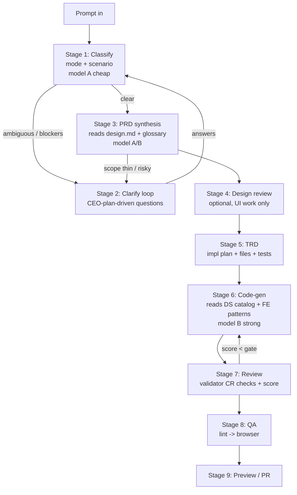

# Intelligent Pipeline — Vision + Architecture — 2026-05-29

> Status: Vision — describes a target state, grounded in current code. No new code wired by this doc.
> Owner: Dash Build daemon team. Product owner: Irfan.
> Builds on: `gstack-adoption.md` (artifact sequencing), `gstack-codex-audit-2026-05-28.md`
> (wired-vs-doc-only status table), `mode-aware-intake-2026-05-29.md` (mode detector),
> `be-aware-intake-2026-05-28.md` (scenario classifier), `context-intake.md` (question budget),
> `artifact-contracts.md`.

---

## TL;DR

Irfan's ask, in his words (paraphrased):

> "I gave you the Gstack repo so the pipeline can be smart about asking questions using the
> CEO plan, then continue to PRD, then to code. Right now I'm not sure there's any correlation.
> I need a VISION of: a prompt comes in → which .md files does it read → it comes BACK to the
> user carrying which skill → back-and-forth until it finally generates code. And I don't want
> this to be just UI — I want it DRAGGABLE like Zapier, so steps can be rearranged/configured.
> And later when we connect API keys, configure WHICH model runs at WHICH step."

This doc answers four things honestly:

1. **What the pipeline actually does today** — and it is shallower than the gstack docs imply.
   The "asking" is **keyword heuristics + section-counting**, not CEO-plan reasoning.
2. **The gstack correlation is aspirational, not real.** The CEO-plan / brainstorming skills
   live at `~/.claude/skills/gstack/plan-ceo-review/` (global, outside this repo) and **no code
   in `src/` reads them**. `gstack-adoption.md` describes a chain that is ~50% wired, 0% gstack-skill-driven.
3. **The target end-to-end flow** — prompt → classify → CEO-plan-driven clarify loop → PRD → design → TRD → code → review → QA → PR, with the "back-and-forth carrying a skill" made explicit.
4. **Two big future features** — a Zapier-style draggable pipeline editor and per-step model routing — framed in phases (P0 hardcoded → P1 config-driven → P2 visual editor).

---

## Part 1 — Current State (honest)

### 1.1 The hardcoded chain

The pipeline is a fixed call sequence. Two layers:

**Orchestrator** (`src/pipeline/orchestrator.ts::processPrompt`, line 904):

```
submitPrompt (orchestrator.ts:400)
  → detectMode() pre-clone gate (orchestrator.ts:416)        — clone only for existing-repo
  → store.addPrompt status=queued
  → processPrompt (orchestrator.ts:904)
      → status=generating (orchestrator.ts:915)
      → auth check anthropic.isConnected() (orchestrator.ts:919)
      → BE-aware intake (orchestrator.ts:938, gated by intakeEnabled)
          → runIntake: scanBeCatalog + readDbSchema + classifyPrompt + detectMode
          → ambiguous & confidence<0.5 → beginClarification (orchestrator.ts:997)  [LOOP BACK]
      → skillChain.run() (orchestrator.ts:1052 / 1107)
      → branch on result.kind:
          clarify   → beginClarification (orchestrator.ts:1129)                     [LOOP BACK]
          error     → failPrompt (orchestrator.ts:1133)
          generated → artifact + CR-3 enforce + design-review + qa + bundle (1140+)
```

**Skill chain** (`src/skills/chain.ts::generateWithSkillChain`, line 95):

```
Stage 1   prd-evaluator       (chain.ts:118)  → clarify gate (chain.ts:130)         [LOOP BACK]
Stage 1a  mode clarify gate   (chain.ts:146)  → clarify if mode ambiguous           [LOOP BACK]
Stage 1b  intake clarify gate (chain.ts:175)  → clarify if scenario ambiguous       [LOOP BACK]
Stage 2+3 design-loader + skill-loader + introspect + existing-files
          + ds-catalog-loader + fe-patterns  (chain.ts:209, all Promise.all)
Stage 4   prompt-composer     (chain.ts:264)  → one big system prompt
Stage 5   model call          (chain.ts:288)  → deps.anthropic.messages.create
Stage 6   response-parser     (chain.ts:305)
Stage 7   validator           (chain.ts:311)  → score 0..100
          → { kind: "generated", … }
```

Post-generation the orchestrator runs two best-effort gstack **stubs**: `reviewDesignCoverage`
(`orchestrator.ts:1244`) and `runDashQa` (`orchestrator.ts:1252`). Neither flips `validation.passed`.

### 1.2 How shallow is the "asking"?

Blunt answer: **the clarify logic is keyword matching and arithmetic, with zero LLM reasoning and zero gstack-skill content.**

- **`prd-evaluator.ts`** (`evaluatePromptScope`, line 98) is a **section counter**. It matches the
  prompt against a hardcoded keyword index of 14 PRD sections (`PRD_SECTIONS`, line 30) — e.g.
  section 4 "Goals" fires on the literal substrings `goal`/`objective`/`metric`/`kpi`/`north star`
  (line 34). Its only clarify trigger: prompt touches `<2` sections **and** is `<12` words, then it
  appends one generic question — *"Prompt scope thin (touches <2 PRD sections). Add brief context?"*
  (`prd-evaluator.ts:122`). That is not a PRD review. It does **not** read `skills/dash-prd/` at
  runtime — the section rules were "distilled" into the keyword list by hand (`prd-evaluator.ts:27`).

- **`clarification/evaluator.ts`** (`evaluatePrompt`, line 235) is **5 regex heuristics**: vague verb
  without surface (line 248), data without source (currently disabled by `P0_MOCK_DATA_ONLY`, line 133/272),
  mitra-facing voice (line 304), legal/financial audit-trail (line 321), scope-blast (line 336). Each
  appends a **fixed, hardcoded English question string** (e.g. `"Where should this feature live?"`,
  line 242).

- **`scenario-classifier.ts`** (`classifyPrompt`, line 320) and **`mode-detector.ts`** (`detectMode`,
  line 151) are likewise **lexicon + regex** classifiers ("Heuristic-only (no LLM call)",
  `scenario-classifier.ts:6`). Their clarify questions are hardcoded English/ID strings
  (e.g. `mode-detector.ts:255`, `scenario-classifier.ts:524`).

So when the pipeline "comes back to ask," it is choosing from a small set of canned questions based on
which keywords matched — **not** reasoning about the product the way `office-hours` / `plan-ceo-review`
would. There is no "find the 10-star product," no premise-challenging, no desperate-specificity probing.

### 1.3 Double-asking / overlapping gates

There are **three** clarify gates that can each fire independently: the intake gate in the orchestrator
(`orchestrator.ts:997`), the mode gate (`chain.ts:146`), and the scenario gate (`chain.ts:175`), plus the
PRD/Agent-F questions (`chain.ts:130`). They share no memory of each other within a single pass, and the
orchestrator runs its own intake-ambiguous gate **before** the chain runs the same check again
(`orchestrator.ts:997` vs `chain.ts:175`) — the comment at `chain.ts:172` even acknowledges the duplication.

### 1.4 Which `.md` files the pipeline reads at runtime

This is the literal "which md does it read" Irfan asked about. Every read is best-effort (degrades to empty on miss):

| `.md` / file | Read at | Contributes |
| --- | --- | --- |
| `design.md` (dash-ds root) | `design-loader.ts:113` → `loadDesignContext` (`chain.ts:204`) | Global cross-repo design contract → system prompt |
| `apps/docs/registry/dash/foundation/rules/cardinal-rules.md` | `design-loader.ts:109` | CR-1..CR-8 cardinal rules → system prompt + validator |
| `apps/docs/registry/dash/foundation/voice/voice-rules.md` | `design-loader.ts:110` | Formal/informal voice register → system prompt |
| `LAYERED-ARCHITECTURE.md` | `design-loader.ts:112` | Layer 0/1/2/3 decision tree → system prompt |
| `apps/docs/registry/dash/foundation/manifest.json` | `design-loader.ts:111` | Tokens + brand hex → system prompt |
| `apps/docs/registry.json` | `ds-catalog-loader.ts:249` → `loadDSContext` (`chain.ts:207`) | 214+ atom/block/template catalog → "use `<Badge>` not raw div" |
| `apps/docs/registry/rules/dash-ai-rules.compressed.md` | `ds-catalog-loader.ts:250` | Compressed AI rules (banned imports etc.) → system prompt |
| `apps/docs/registry/rules/dash-domain-glossary.md` | `ds-catalog-loader.ts:251` (truncated ~12K chars, line 273) | Domain entities/tables/state machines → system prompt |
| `@dash/skill` (per-repo stack mandate, `version:2`) | `skill-loader.ts:23` | Per-repo stack + banned imports → system prompt |
| target-repo FE component sources | `read-fe-patterns.ts` (`chain.ts:238`) | 1-3 reference components → mirror local style |
| target-repo BE routes + DB schema | `scanBeCatalog` / `readDbSchema` (`orchestrator.ts:947`) | Endpoint + table catalog → scenario classification |

**Not read at runtime today:** `skills/dash-prd/prompts/section-rules.md` (hand-distilled into code),
and **any gstack skill** (`plan-ceo-review`, `office-hours`, `plan-eng-review`). See 1.6.

### 1.5 Model routing today

**One model, everything.** `chain.ts:45`:

```ts
export const DEFAULT_MODEL_ID = process.env.DASH_BUILD_OPENAI_MODEL ?? "codex-default"
```

The single chain call passes `model: modelId` (`chain.ts:289`). Auth + dispatch live in
`AuthenticatedOpenAIClient` (`src/auth/openai/client.ts`): `getMode()` (line 27) resolves
`codex-cli | byo-key | none`, and `complete()` (line 44) accepts an `opts.model` override (line 49)
but the chain never varies it per stage. The classifiers/evaluators make **no model calls at all** —
they are pure functions. So there is exactly one place a model is invoked (`chain.ts:288`), and it
always uses the same model. **Per-step routing has no hook yet.**

### 1.6 The gstack correlation: aspirational, not real

`gstack-adoption.md` (line 31) maps gstack skills to Dash stages:

| gstack | Dash stage | Reality |
| --- | --- | --- |
| `/office-hours` | `dash-intake` | intake **wired**, but it is regex classifiers — **office-hours skill not read** |
| `/plan-ceo-review` | `dash-prd-review` | **doc-only** — `prd-evaluator.ts` is a section counter, **does not read the CEO-plan skill** |
| `/plan-design-review` | `dash-design-review` | **stub** — `design-review.ts` counts atom coverage post-gen |
| `/plan-eng-review` | `dash-trd` | **doc-only** — absorbed into system prompt, no TRD artifact |
| `/review` | `dash-review` | **wired** — `validator.ts` (CR checks + score) |
| `/qa` | `dash-qa` | **stub** — `qa.ts` deterministic lint, not browser QA |

The CEO-plan skill physically exists on this machine at
`~/.claude/skills/gstack/plan-ceo-review/SKILL.md` (and `office-hours`, `plan-eng-review` alongside it),
but it is a **global Claude Code skill, outside the repo**, and **nothing in `packages/dash-build/src`
imports, reads, or references it** (confirmed: `grep -rn "plan-ceo\|office-hours\|ceo-plan" src` returns
nothing). The gstack-codex audit reached the same conclusion: dash-prd/dash-trd are "doc-only," design-review/qa are "stub added" (`gstack-codex-audit-2026-05-28.md`, TL;DR table).

**So: the "CEO plan → PRD → code" chain Irfan envisioned is not happening.** The pipeline never consults
the CEO-plan reasoning to decide what to ask. That is the central gap this vision closes.

---

## Part 2 — Vision (target state)

### A. End-to-end flow (target)



Per-stage contract. "Carries a skill" = the stage loads a named skill `.md` and uses its reasoning to
produce its output, and (for clarify) returns to the user *with that skill's framing attached*.

| # | Stage | Input | Reads (.md / skill) | Model tier | Output | Loops back when |
| --- | --- | --- | --- | --- | --- | --- |
| 1 | **Classify** | raw prompt, selectedRepo | (none — pure) + optional `office-hours` for tie-breaks | A (cheap) | `{mode, scenario, confidence}` | n/a |
| 2 | **Clarify** | classification, prompt | **`plan-ceo-review` SKILL.md** + `office-hours` + `context-intake.md` budget | A (cheap) | questions[] (user's language) | until blockers resolved |
| 3 | **PRD** | prompt + answers | `design.md`, `dash-domain-glossary.md`, `dash-prd` section-rules | A or B | PRD artifact (problem/user/objective/scope/non-goals/AC) | scope still risky → Stage 2 |
| 4 | **Design review** | PRD | `design.md`, `LAYERED-ARCHITECTURE.md`, `voice-rules.md`, registry catalog | A | design brief (audience/density/states/atoms) | UI-only; skipped otherwise |
| 5 | **TRD** | PRD + design + intake | `cardinal-rules.md`, per-repo `@dash/skill`, BE/DB catalog | A or B | impl plan (files/data/state/tests/risks) | code path unclear → Stage 2 |
| 6 | **Code-gen** | TRD + all context | `registry.json` catalog, FE patterns, compressed rules | **B (strong)** | files[] + patches[] + explanation | n/a |
| 7 | **Review** | generated artifact | cardinal rules, stack mandate | A (or pure) | score 0..100 + errors[] | score < gate → Stage 6 |
| 8 | **QA** | artifact | runbook | A + browser harness | pass/fail + issues[] | hard fail → Stage 6 |
| 9 | **Ship** | passing artifact | — | — | preview bundle + PR | n/a |

The **"comes BACK carrying a skill"** moment is Stages 2/3/5. Today the clarify payload is a bare
question string. In the target, the clarify payload carries `{ skill: "plan-ceo-review", framing,
questions[] }` so the UI can show *why* it's asking and in what mode (e.g. SCOPE EXPANSION vs HOLD SCOPE).

### B. The gstack CEO → PRD → code correlation (concrete)

The fix is to make Stage 2 (Clarify) and Stage 3 (PRD) actually **consume the gstack skills** instead of
keyword tables.

**Stage 2 — clarify driven by `plan-ceo-review`.** The skill at
`~/.claude/skills/gstack/plan-ceo-review/SKILL.md` defines four review modes (SCOPE EXPANSION / SELECTIVE
EXPANSION / HOLD SCOPE / SCOPE REDUCTION) and the "find the 10-star product, challenge premises"
discipline, and `office-hours` defines six forcing questions (demand reality, status quo, desperate
specificity, narrowest wedge, observation, future-fit). Target behavior:

1. A `skill-reader` module resolves and reads these `.md` files (search order: bundled copy in
   `packages/dash-build/skills/gstack/`, then `~/.claude/skills/gstack/`, then `$GSTACK_HOME`). Bundling a
   vendored copy is preferred so the daemon is not dependent on a per-machine global install.
2. Stage 2 makes a **cheap-model** call: system = the CEO-plan/office-hours skill body + Dash
   `context-intake.md` question budget (0 questions for typos, 1-2 normal, 3-5 cross-surface, stop-and-ask
   for legal/financial); user = the raw prompt + classification. Output = a *small* set of outcome-framed
   questions, **in the user's language** (the model is instructed to mirror the prompt's language; Irfan's
   prompts are bilingual ID/EN).
3. This replaces the canned strings in `evaluator.ts` / `prd-evaluator.ts`. The existing regex heuristics
   stay as a **deterministic fallback** when no model is connected (preserving hermetic tests).

**Stage 3 — PRD consumes the answers.** The accumulated `{prompt, classification, answers[]}` becomes the
input to a PRD synthesis call that reads `design.md` + `dash-domain-glossary.md` + the `dash-prd`
section-rules and emits a real PRD artifact (problem, user, objective, scope, non-goals, acceptance
criteria) persisted to `<runDir>/prd.json`. This is the artifact `gstack-adoption.md:92` already specifies
but which is currently absorbed into the prompt.

**Flow to code.** PRD → (design brief) → TRD → the existing `prompt-composer` (`chain.ts:264`) consumes the
TRD instead of guessing from one paragraph. Code-gen, review, QA, ship are largely the wired path today;
the win is that everything downstream now receives *frozen, reasoned context* rather than a raw sentence.
This is exactly the "design and Skill v4 consume richer context" outcome `gstack-adoption.md:126` calls for.

### C. Draggable pipeline editor (Zapier-style)

Vision: the pipeline is **data, not code**. A node-graph the user can rearrange and configure.

**Node types** (one per stage above, plus structural):

- `classify`, `clarify`, `prd`, `design-review`, `trd`, `code-gen`, `review`, `qa`, `ship`
- `branch` (conditional — e.g. "if scenario == fe_only, skip TRD")
- `loop-back` (edge with a condition — e.g. "if score < 70, return to code-gen, max 2 retries")

**Node config** (each node):

```
{ id, type, skill?: "plan-ceo-review", reads: [".md sources"], model: "tier-or-id",
  loopBackTo?: nodeId, loopCondition?: expr, maxLoops?: n, enabled: bool }
```

**Canvas:** drag nodes from a palette onto a canvas, connect output ports to input ports, click a node to
open a config drawer (which skill, which `.md` sources, which model, loop-back rules). A run animates token
flow node-by-node — the AOP narration the orchestrator already emits (`run.start`/`scan`/`thinking`/
`validate`/`artifact`, `orchestrator.ts:455+`) maps one-to-one onto node highlights, so the live-run view
is mostly already there.

**Persistence:** the graph serializes to a `pipeline-config.json` (see Part D for schema). It lives per
workspace (and can be templated). Editing the graph never touches `src/`.

**Execution:** the orchestrator gains a `runGraph(config, prompt)` that topologically walks the node list
instead of calling the hardcoded chain. Each node maps to an existing function:
`classify→detectMode/classifyPrompt`, `clarify→skill-driven evaluator`, `code-gen→generateWithSkillChain`
Stage 4-7, `review→validateOutput`, `qa→runDashQa`. The hardcoded chain becomes the **default seed graph**,
so P0 and P2 produce identical behavior when the graph is the default.

**Phasing is essential** — this is a big feature:

- **P0 (today):** hardcoded chain in `chain.ts` + `orchestrator.ts`. Works.
- **P1:** config-driven — `pipeline-config.json` exists; `runGraph` executes a *linear* configurable list
  (reorder, enable/disable, set model per node, set loop conditions). No visual editor yet — edited as JSON
  or a simple list UI.
- **P2:** the visual Zapier canvas (React Flow or similar) reads/writes the same `pipeline-config.json`.
  Pure front-end on top of P1's executor.

### D. Per-step model routing

When API keys are connected, map cheap models to cheap stages and strong models to code-gen.

**Where it hooks in:** `AuthenticatedOpenAIClient.complete()` already takes `opts.model` (`client.ts:49`)
and dispatches per-mode (`client.ts:54/64`). The chain already plumbs a `modelId` (`chain.ts:100`,
`chain.ts:289`). The missing piece is a **per-stage resolver** that reads the node's `model` field and
passes it down. No client change is required for BYO-key; Codex-CLI mode would need `complete()` to honor
`opts.model` (the runner accepts a `model` param, `client.ts:58`).

**Schema** (`models` block in `pipeline-config.json`): tiers are aliases mapped to concrete IDs, and any
node can reference a tier or a raw model ID.

```json
{
  "version": 1,
  "models": {
    "tiers": {
      "cheap":  { "provider": "openai", "model": "gpt-5-mini" },
      "strong": { "provider": "openai", "model": "gpt-5" }
    },
    "default": "strong"
  },
  "nodes": [
    { "id": "classify",  "type": "classify",  "model": "none",   "enabled": true },
    { "id": "clarify",   "type": "clarify",   "skill": "plan-ceo-review",
      "reads": ["~/.claude/skills/gstack/plan-ceo-review/SKILL.md", "docs/context-intake.md"],
      "model": "cheap",  "enabled": true },
    { "id": "prd",       "type": "prd",
      "reads": ["design.md", "apps/docs/registry/rules/dash-domain-glossary.md"],
      "model": "cheap",  "enabled": true },
    { "id": "design",    "type": "design-review",
      "reads": ["design.md", "LAYERED-ARCHITECTURE.md"],
      "model": "cheap",  "enabled": false },
    { "id": "trd",       "type": "trd",        "model": "cheap",  "enabled": true },
    { "id": "codegen",   "type": "code-gen",
      "reads": ["apps/docs/registry.json", "apps/docs/registry/rules/dash-ai-rules.compressed.md"],
      "model": "strong", "enabled": true },
    { "id": "review",    "type": "review",     "model": "none",   "enabled": true,
      "loopBackTo": "codegen", "loopCondition": "score < 70", "maxLoops": 2 },
    { "id": "qa",        "type": "qa",         "model": "none",   "enabled": true },
    { "id": "ship",      "type": "ship",       "model": "none",   "enabled": true }
  ]
}
```

`"model": "none"` = pure function, no LLM call (classify/review/qa today). `DASH_BUILD_OPENAI_MODEL`
(`chain.ts:45`) becomes the fallback for `models.default` when no config is present.

---

## Part 3 — Phasing + effort

| Phase | Scope | Effort (honest) |
| --- | --- | --- |
| **P0 — gstack-real clarify (buildable now)** | New `skill-reader` (resolve + read CEO-plan/office-hours `.md`). New skill-driven clarify path in Stage 2 that makes a cheap-model call; keep regex heuristics as fallback. Add user-language instruction. Emit a real `prd.json` artifact. | 2-3 days |
| **P0.1 — collapse double-asking** | Merge the orchestrator intake gate (`orchestrator.ts:997`) and chain gates (`chain.ts:146/175`) into one clarify pass that dedupes questions across mode/scenario/PRD. | 0.5-1 day |
| **P1 — config-driven chain** | `pipeline-config.json` schema + loader + `runGraph` linear executor mapping node types to existing functions. Per-node model resolver into `complete(opts.model)`. Seed = current chain. | 1-1.5 weeks |
| **P2 — visual Zapier editor** | React Flow canvas, node palette, config drawer, live-run highlighting off existing AOP events, persistence to `pipeline-config.json`. Front-end only on P1's executor. | 2-3 weeks |

P0 alone delivers the thing Irfan actually noticed missing: the pipeline asking *smart* questions from the
CEO plan instead of canned ones, in his language, then carrying answers into a real PRD.

---

## Part 4 — Gaps today (blunt list)

1. **`prd-evaluator.ts` does not read the CEO plan.** It is a 14-keyword section counter
   (`prd-evaluator.ts:30`); the `dash-prd` section-rules were hand-distilled into code, not read at runtime
   (`prd-evaluator.ts:27`).
2. **No gstack skill is read anywhere.** `plan-ceo-review` / `office-hours` / `plan-eng-review` exist at
   `~/.claude/skills/gstack/` but `grep` of `src/` finds zero references. The "CEO plan → PRD → code"
   correlation does not exist in code.
3. **Clarify questions are hardcoded English strings.** `evaluator.ts:242/258/282/314/329`,
   `mode-detector.ts:255`, `scenario-classifier.ts:524` — no language adaptation, no reasoning.
4. **No model routing.** One `DEFAULT_MODEL_ID` for everything (`chain.ts:45`); only one LLM call site
   (`chain.ts:288`); classifiers/evaluators make no model calls.
5. **No pipeline config.** The chain is hardcoded in `chain.ts` + `orchestrator.ts`; not data, not reorderable.
6. **Three overlapping clarify gates** with no shared memory; orchestrator + chain run the same
   ambiguous-scenario check twice (`orchestrator.ts:997` vs `chain.ts:175`; comment at `chain.ts:172`).
7. **No PRD / TRD artifacts.** PRD scope is a one-line `summary` (`prd-evaluator.ts:107`); TRD is absorbed
   into the system prompt (`gstack-codex-audit-2026-05-28.md` marks both doc-only).
8. **`dash-design-review` + `dash-qa` are post-gen stubs**, not pre-gen reasoning passes
   (`orchestrator.ts:1244/1252`); QA is a lint, not a browser pass.
9. **`OPENAI_API_KEY` env-var fallback not wired** (`gstack-codex-audit-2026-05-28.md` §#0O gap 1) —
   relevant once per-step routing wants to address multiple keys/providers.

---

## Appendix — files cited

- `src/pipeline/orchestrator.ts` — processPrompt flow, intake gate, AOP narration, post-gen stubs.
- `src/skills/chain.ts` — the hardcoded 7-stage chain + `DEFAULT_MODEL_ID`.
- `src/skills/prd-evaluator.ts` — section-counting "PRD" gate.
- `src/clarification/evaluator.ts` — 5 regex clarify heuristics.
- `src/intake/scenario-classifier.ts`, `src/intake/mode-detector.ts` — lexicon classifiers.
- `src/skills/design-loader.ts`, `src/skills/ds-catalog-loader.ts`, `src/skills/skill-loader.ts` — `.md` readers.
- `src/auth/openai/client.ts` — `AuthenticatedOpenAIClient`, the single model-dispatch point.
- `docs/gstack-adoption.md`, `docs/gstack-codex-audit-2026-05-28.md` — intended chain + wired-vs-doc status.
- `~/.claude/skills/gstack/plan-ceo-review/SKILL.md` — the CEO-plan skill, currently unread by the pipeline.
